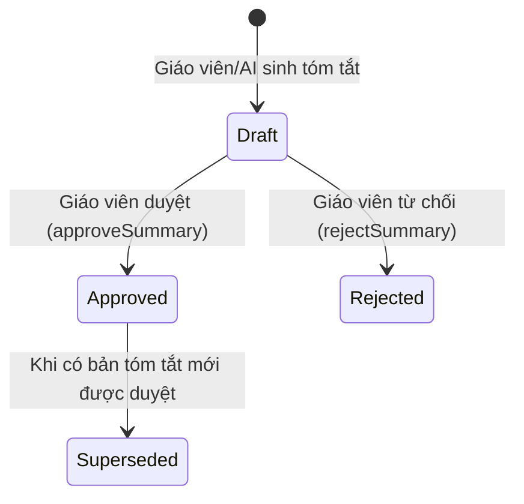

# Chi Tiết Các Tính Năng AI (Features Specification)

Tài liệu này mô tả chi tiết 5 tính năng AI chính dành cho học sinh, giáo viên và tính năng Quản trị hệ thống AI (Admin Console).

---

## 1. Trợ Lý AI Chat Bài Giảng (RAG Chatbot Assistant)

### 🎯 Mục đích
Cung cấp một trợ lý học tập thông minh ngay trong giao diện bài học, trả lời thắc mắc của học sinh dựa đúng trên tài liệu bài giảng do giáo viên cung cấp, kèm trích dẫn nguồn cụ thể.

### ⚙️ Quy trình xử lý (Workflow)
1. Học sinh gửi câu hỏi trong giao diện bài học (`AIChatWidget.tsx`).
2. Backend kiểm tra quyền truy cập lớp học/bài học (`_validateSessionAccess`).
3. Kiểm tra chống spam & Prompt Injection.
4. Chuyển câu hỏi thành Vector Embedding và thực hiện Vector Search trên Atlas MongoDB (`AIVectorRetrieverService`).
5. Lấy tối đa `RAG_TOP_K=5` chunk tài liệu có độ tương đồng `>= 0.65`.
6. Ghép context bài học + 10 tin nhắn gần nhất vào prompt.
7. Gọi `AICoreService` nhận phản hồi JSON (gồm câu trả lời `answer`, danh sách `citationIds`, điểm tin cậy `confidence`, câu hỏi gợi ý `followUpQuestions`).
8. Trả về kết quả kèm các link trích dẫn cho học sinh.

### 🛡️ Trường hợp đặc biệt (Edge Cases)
- **Nếu không tìm thấy thông tin phù hợp trong tài liệu**: Trả về câu phản hồi an toàn: *"Tôi chưa tìm thấy thông tin này trong tài liệu bài học. Vui lòng hỏi các nội dung nằm trong phạm vi bài giảng."*
- **Tùy chỉnh phân quyền**: Giáo viên phụ trách lớp và Học sinh thuộc lớp đã đăng ký mới được quyền dùng AI Chat.

---

## 2. Tóm Tắt Bài Giảng Tự Động (AI Lesson Summary)

### 🎯 Mục đích
Tự động phân tích nội dung bài học (văn bản + tệp đính kèm PDF/DOCX) để tạo ra bản tóm tắt súc tích, trích xuất các điểm chính (Key Points) và chủ đề cần ôn tập (Review Topics).

### ⚙️ Quy trình xử lý & Duyệt (Approval Workflow)

1. **Sinh dữ liệu (Generation)**: Trích xuất toàn bộ văn bản từ bài giảng (`lessonContentExtractor`). Sinh bản tóm tắt ở trạng thái `draft`.
2. **Duyệt bài (Review & Approval)**:
   - Giáo viên / Admin xem bản nháp.
   - Nếu đồng ý -> Gọi API `approveSummary`. Bản tóm tắt chuyển sang trạng thái `approved` (các bản approved trước đó chuyển thành `superseded`).
   - Nếu không đồng ý -> Gọi API `rejectSummary` kèm lý do từ chối.
3. **Hiển thị cho học sinh**: Học sinh chỉ nhìn thấy bản tóm tắt đã được duyệt (`approved`).

---

## 3. Tự Động Sinh Bộ Câu Hỏi & Đề Thi (AI Question Generation)

### 🎯 Mục đích
Giúp giáo viên tiết kiệm thời gian biên soạn câu hỏi bằng cách tự động tạo các bộ đề thi trắc nghiệm và tự luận từ nội dung bài học.

### ⚙️ Đặc điểm kỹ thuật
- **Cấu hình đa dạng**:
  - Số lượng câu hỏi (`questionCount`).
  - Loại câu hỏi (`questionTypes`: `multiple_choice`, `true_false`, `short_answer`, `essay`).
  - Phân bổ độ khó (`difficultyDistribution`: `easy`, `medium`, `hard`).
  - Ngôn ngữ & Hướng dẫn bổ sung (Prompt tùy chỉnh).
- **Tránh trùng lặp (Idempotency)**: Tạo `sourceFingerprint` từ nội dung bài học + cấu hình yêu cầu. Nếu gửi 2 yêu cầu trùng lặp trong thời gian ngắn, hệ thống trả về lỗi HTTP 409 Conflict hoặc bộ đề đã tạo trước đó.
- **Tự động lưu vào Folder / ExamSet**: Bộ câu hỏi sau khi sinh được ghi trực tiếp dưới dạng bản nháp (`draft`) vào module `ExamSet` để giáo viên chỉnh sửa thêm.

---

## 4. Hỗ Trợ Chấm Bài Tự Luận (AI Essay Grading Assistant)

### 🎯 Mục đích
Hỗ trợ giáo viên chấm các câu hỏi tự luận / câu trả lời ngắn bằng AI, gợi ý số điểm và nhận xét chi tiết theo tiêu chí (Rubric).

### ⚙️ Quy trình Chấm & Xác Nhận (Grading & Confirmation Workflow)
1. **Tạo gợi ý (Generate Suggestion)**:
   - Hệ thống lấy câu hỏi, đáp án mẫu, bài làm học sinh và tiêu chí chấm điểm (Rubric).
   - AI phân tích và đưa ra điểm gợi ý (`suggestedScore`), độ tin cậy (`confidence`), nhận xét chi tiết (`aiFeedback`) và điểm từng tiêu chí (`criterionScores`).
   - Kết quả được lưu tạm trong collection `AIGradingSuggestion` ở trạng thái `PENDING_REVIEW` (chưa ghi đè trực tiếp vào bài thi của học sinh).
2. **Giáo viên xem xét & quyết định (Teacher Action)**:
   - **`accept`**: Chấp nhận hoàn toàn điểm gợi ý của AI.
   - **`adjust`**: Điều chỉnh lại số điểm theo ý giáo viên.
   - **`reject`**: Bỏ qua gợi ý AI.
3. **Cập nhật điểm chính thức**: Sau khi giáo viên xác nhận (`accept` hoặc `adjust`), số điểm mới được cập nhật vào bản ghi `ExamAttempt` và tính lại tổng điểm bài thi.

---

## 5. Trích Xuất & Chỉ Mục Tri Thức (AI Knowledge Indexing)

### 🎯 Mục đích
Tự động xử lý và lập chỉ mục Vector cho tất cả các nguồn tri thức của bài học để phục vụ tính năng RAG.

### 📚 Nguồn dữ liệu hỗ trợ
1. **Nội dung văn bản bài giảng** (Tiêu đề, Mô tả).
2. **File tài liệu đính kèm**:
   - File PDF: Trích xuất chữ bằng `pdf-parse`.
   - File Word DOCX: Trích xuất chữ bằng `mammoth`.
3. **Bản tóm tắt bài giảng đã duyệt (`approved_summary`)**.

### 🔄 Quản lý phiên bản chỉ mục (Indexing Versioning)
Mỗi khi bài học hoặc tài liệu thay đổi, chỉ mục mới được gán `indexVersion` tăng dần. Khi phiên bản mới lập chỉ mục thành công ở trạng thái `ready`, các phiên bản cũ tự động chuyển thành `superseded`.

---

## 6. Bảng Điều Khiển Quản Trị AI (AI Management Console)

Dành cho Quản trị viên (Admin) quản lý toàn bộ hạ tầng AI trên giao diện Frontend (`AIManagementPage.tsx`):
- **Cấu hình mô hình AI**: Chọn Provider mặc định (`google-gemini`, `mock`), cấu hình Model Name, temperature.
- **Quản lý Hạn mức Quota**: Đặt số lượt gọi AI tối đa trong ngày cho từng vai trò (`Student`, `Teacher`, `Admin`).
- **Quản lý Prompt Templates**: Tùy chỉnh prompt hệ thống cho các tính năng Chat, Summary, Grading, Question Generation.
- **Thống kê Sử dụng & Chi phí (Usage & Analytics)**: Theo dõi tổng lượng Token tiêu thụ, số lượt thành công/lỗi, và chi phí USD ước tính theo thời gian thực.
- **Quản lý Tri thức RAG (Knowledge Base)**: Xem danh sách các file/chunk đã index, trạng thái index, và kích hoạt re-index thủ công.
