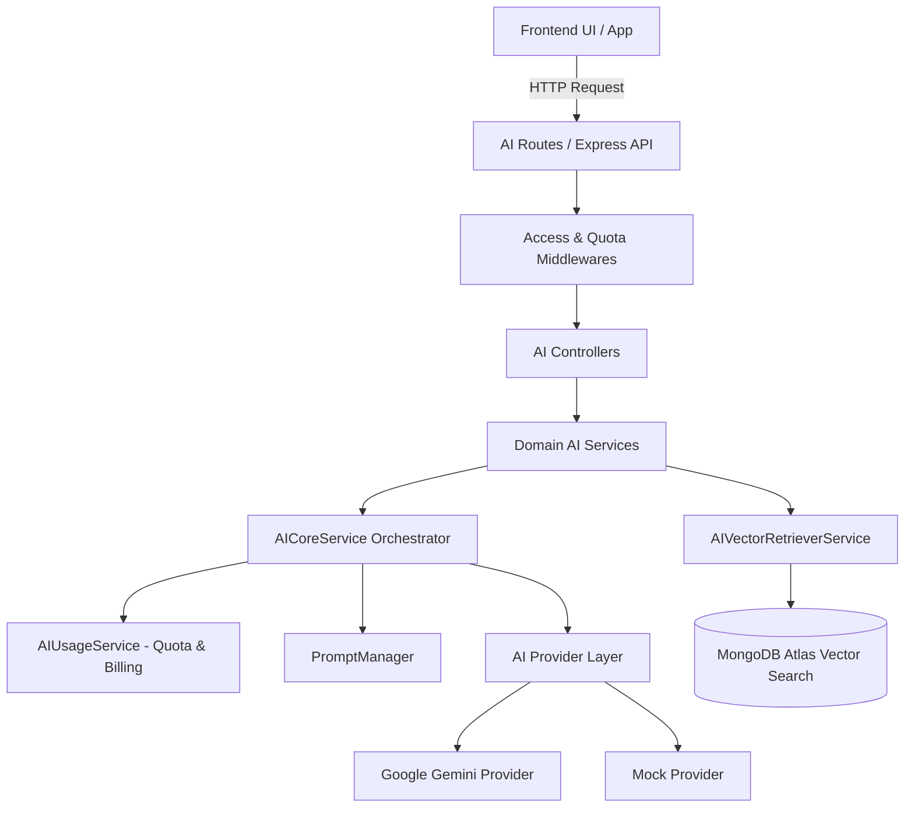

# Kiến Trúc Tổng Quan & AI Core (Overview & Architecture)

## 1. Tổng Quan Kiến Trúc (Architecture Overview)

Hệ thống AI trong AI-LMS được thiết kế theo mô hình **Modular Monolith** kết hợp với **Provider Pattern** để quản lý các tác vụ AI linh hoạt, có khả năng mở rộng và chịu lỗi cao.

---

## 2. Các Thành Phần Nòng Cốt (Core Components)

### 2.1 `AICoreService` (`Backend/src/modules/ai/services/aiCore.service.js`)
`AICoreService` đóng vai trò là Orchestrator trung tâm xử lý mọi yêu cầu gọi mô hình AI:
- **Tự động chọn Provider**: Phân giải giữa `GoogleGemini` và `MockProvider` tùy thuộc biến môi trường (`AI_MOCK_MODE`, `AI_PROVIDER`) hoặc cấu hình trong cơ sở dữ liệu (`AIConfig`).
- **Thực thi AI có cấu trúc (Structured AI Execution)**: Nhận `promptParams`, `responseSchema`, `validatorFunc` và thực hiện cuộc gọi tới LLM với đầu ra JSON định dạng ngặt nghèo.
- **Tích hợp Quota Lifecycle**: Gọi `AIUsageService.reserveQuota` trước khi thực thi và `AIUsageService.finalizeUsage` sau khi hoàn tất (hoặc báo lỗi).
- **Phân tích & Kiểm tra dữ liệu (Validation & Parsing)**: Dùng `safeParseJSON` kết hợp với hàm kiểm tra logic tùy biến (`validatorFunc`).

### 2.2 Provider Layer (`Backend/src/modules/ai/providers/`)
Hỗ trợ cơ chế cắm rút (Plug-and-Play) mô hình AI:
- **`BaseAIProvider`** (`base.provider.js`): Định nghĩa Interface chuẩn hóa cho tất cả các AI Providers (`generateJSON`, `generateEmbedding`, `getName`, `getModelName`).
- **`GeminiAIProvider`** (`gemini.provider.js`): Tích hợp SDK chính thức của Google Gemini (`@google/genai`). Hỗ trợ cấu hình `systemInstruction`, `responseSchema`, `temperature`, `timeoutMs` và `generateEmbedding` với số chiều vector linh hoạt (`dimensions`).
- **`MockAIProvider`** (`mock.provider.js`): Dùng cho môi trường thử nghiệm (Test / CI/CD) hoặc khi không có API key thật. Sinh dữ liệu giả lập chuẩn schema.

---

## 3. Kiến Trúc RAG Engine (Retrieval-Augmented Generation)

Tính năng RAG phục vụ Trợ lý AI Chat giải đáp câu hỏi theo nội dung bài học.

### 3.1 Quy Trình Xử Lý RAG (Pipeline Flow)

1. **Trích xuất dữ liệu (Extraction)**: `LessonContentExtractorService` đọc nội dung văn bản bài giảng, file PDF (`pdf-parse`) hoặc Word DOCX (`mammoth`).
2. **Phân đoạn văn bản (Chunking)**: `TextChunkerService` chia nhỏ nội dung thành các chunk ký tự có độ dài cố định (`RAG_CHUNK_MAX_CHARS=2400`) và đoạn chồng lấp (`RAG_CHUNK_OVERLAP_CHARS=300`).
3. **Tạo Vector Embedding**: Dùng mô hình embedding (mặc định `gemini-embedding-2`, 768 dimensions) để tạo vector toán học đại diện cho từng chunk.
4. **Lưu trữ tri thức (Storage)**: Chunk và vector được lưu vào Mongo collection `aiknowledgechunks`.
5. **Truy vấn Vector (Retrieval)**: `AIVectorRetrieverService` thực thi toán tử `$vectorSearch` trên MongoDB Atlas với các điều kiện lọc (Pre-filter: `classId`, `lessonId`, `status: ready`, `isDeleted: false`).
6. **Tổng hợp phản hồi (Synthesis)**: Ghép các chunk có độ tương đồng cao nhất (`RAG_MIN_SCORE >= 0.65`) vào prompt gửi cho LLM để tạo câu trả lời kèm trích dẫn (`citations`).

---

## 4. Quản Lý Quota, Hạn Mức & Chi Phí (`AIUsageService`)

Hệ thống quản lý tài nguyên AI đa tầng bảo vệ server khỏi bị quá tải hoặc lãng phí chi phí:

### 4.1 Hạn Mức Theo Vai Trò (Role Quotas)
Cấu hình trong `AIConfig`:
- **Student**: Mặc định 30 lượt / ngày.
- **Teacher**: Mặc định 100 lượt / ngày.
- **Admin**: Mặc định 500 lượt / ngày.

### 4.2 Cơ Chế Giữ Chỗ & Hoàn Hạn Mức Atomic (Atomic Quota Reservation & Refund)
- **`reserveQuota`**: Sử dụng giao dịch MongoDB (Transaction) kết hợp toán tử `$inc` atomic để giữ trước 1 lượt dùng trong `AIDailyQuota`. Tránh tình trạng Race Condition khi người dùng gửi đồng thời nhiều request.
- **`finalizeUsage`**: Khi yêu cầu thành công, đánh dấu quota là `consumed` và tính toán chi phí (Tokens & USD). Nếu yêu cầu thất bại (Error/Timeout), hệ thống chuyển trạng thái sang `refunded` và tự động hoàn lại lượt dùng cho người dùng.

### 4.3 Quản Lý Cờ Tính Năng (Feature Flags)
Hỗ trợ bật/tắt toàn hệ thống hoặc theo từng tính năng cụ thể (`summary`, `question-gen`, `exam-gen`, `grading`, `chatbot`, `knowledge-index`).

---

## 5. An Toàn Dữ Liệu & Bảo Mật Prompt (Security & Budgeting)

1. **Chống Prompt Injection (`_isObviousPromptInjection`)**: Lọc bớt các từ khóa độc hại hoặc cố tình phá vỡ cấu trúc câu lệnh hệ thống (`ignore previous instructions`, `system prompt`, `đáp án`, `api key`,...).
2. **Chống Double Submit & Idempotency**:
   - Sử dụng Fingerprint Hash (`sha256`) tạo từ dữ liệu đầu vào.
   - Giới hạn tần suất gọi AI Chat (Tối thiểu cách nhau 5 giây giữa 2 câu hỏi giống nhau).
   - Kiểm tra trùng lặp bản tóm tắt hoặc bộ đề thi sinh ra trước đó để trả về dữ liệu cũ thay vì gọi lại LLM.
3. **Giới Hạn Ngân Sách Đầu Vào (`AIInputBudget`)**: Kiểm tra kích thước văn bản đầu vào trước khi đưa vào LLM để tránh vượt mốc Token Limit và ngăn ngừa tấn công DoS chi phí.
