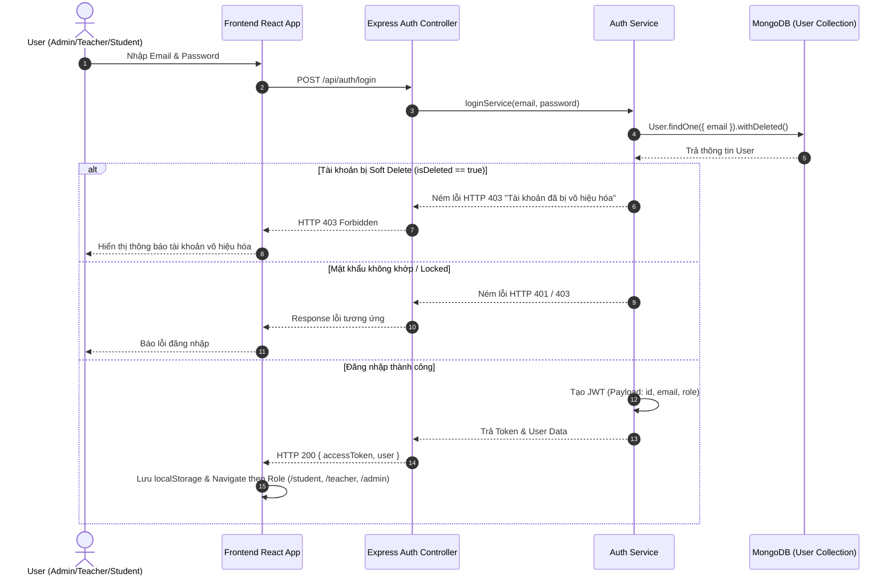
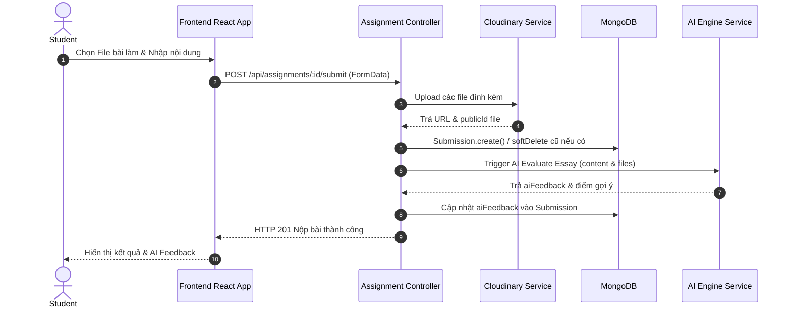

# Tài liệu Kiến trúc Hệ thống AI-LMS (System Architecture Document)

Tài liệu thiết kế kiến trúc tổng thể cho Hệ thống Quản lý Học tập Thông minh tích hợp Trí tuệ Nhân tạo (AI-Powered Learning Management System - AI-LMS).

---

## 📑 MỤC LỤC
1. [Tổng quan Hệ thống](#1-tổng-quan-hệ-thống)
2. [Kiến trúc Tổng thể (High-Level Architecture)](#2-kiến-trúc-tổng-thể-high-level-architecture)
3. [Kiến trúc Backend (Node.js/Express)](#3-kiến-trúc-backend-nodejs-express)
4. [Kiến trúc Frontend (React 19/Vite/Ant Design 5)](#4-kiến-trúc-frontend-react-19-vite-ant-design-5)
5. [Luồng Giao tiếp Frontend ↔ Backend](#5-luồng-giao-tiếp-frontend--backend)
6. [Luồng Realtime Socket.io](#6-luồng-realtime-socketio)
7. [Luồng Tích hợp AI Service](#7-luồng-tích-hợp-ai-service)
8. [Luồng Xác thực & Phân quyền (Authentication & Authorization Flow)](#8-luồng-xác-thực--phân-quyền-authentication--authorization-flow)
9. [Kiến trúc Triển khai (Deployment Architecture)](#9-kiến-trúc-triển-khai-deployment-architecture)
10. [Sơ đồ Thành phần (Component Diagram)](#10-sơ-đồ-thành-phần-component-diagram)
11. [Sơ đồ Trình tự (Sequence Diagrams)](#11-sơ-đồ-trình-tự-sequence-diagrams)
12. [Cấu trúc Thư mục Dự án (Folder Structure)](#12-cấu-trúc-thư-mục-dự-án-folder-structure)
13. [Kiến trúc Mã nguồn (Coding Architecture Patterns)](#13-kiến-trúc-mã-nguồn-coding-architecture-patterns)
14. [Tổng quan Thư viện Phụ thuộc (Dependency Overview)](#14-tổng-quan-thư-viện-phụ-thuộc-dependency-overview)

---

## 1. TỔNG QUAN HỆ THỐNG

**AI-LMS** là hệ thống quản lý học tập thế hệ mới được thiết kế theo hướng Enterprise Data-Driven Architecture, hỗ trợ 3 nhóm người dùng chính: **Admin**, **Teacher (Giảng viên)**, và **Student (Học sinh/Sinh viên)**.

### Mục tiêu cốt lõi:
- **Tối ưu trải nghiệm dạy và học**: Tự động hóa quá trình điểm danh, ra bài tập, chấm điểm tự luận/trắc nghiệm, và tổ chức phòng học trực tuyến (Live Session).
- **Tích hợp AI trợ lý thông minh (AI-Powered)**: Hỗ trợ giảng viên tự động tạo ngân hàng câu hỏi, sinh đề thi theo độ khó, chấm bài luận tự động, gợi ý phản hồi và hỗ trợ sinh viên với AI Learning Assistant.
- **Enterprise Data Architecture**: Áp dụng Enterprise Soft Delete Plugin, Single Source of Truth (SSOT) cho Dashboard, bảo vệ dữ liệu với RBAC (Role-Based Access Control) đa tầng.

---

## 2. KIẾN TRÚC TỔNG THỂ (HIGH-LEVEL ARCHITECTURAL OVERVIEW)

Hệ thống tuân theo kiến trúc Client-Server (Single Page Application + RESTful API Gateway + WebSockets + External AI Proxies).

```mermaid
graph TD
    subgraph Client Layer (Frontend)
        SPA[React 19 SPA - Vite + TS]
        AntD[Ant Design 5 UI Component System]
        State[React Context / Custom Hooks]
        Axios[Axios HTTP Client Interceptor]
        SocketClient[Socket.io Client Provider]
    end

    subgraph API Gateway & Server Layer (Backend)
        ExpressApp[Express.js Server Node 18+]
        AuthMiddleware[JWT & RBAC Middleware Guard]
        RouterLayer[Modular Express Routers]
        ServiceLayer[Business Logic Services]
        SoftDeletePlugin[Mongoose Soft Delete Plugin]
        SocketServer[Socket.io Server]
    end

    subgraph Data & Persistence Layer
        MongoDB[(MongoDB Database Enterprise)]
        Cloudinary[(Cloudinary Media Assets CDN)]
    end

    subgraph External AI Services Layer
        OpenAI[Google Gemini / OpenAI Proxy API]
    end

    SPA -->|HTTPS REST Requests| Axios
    Axios -->|Bearer Token HTTP Headers| AuthMiddleware
    AuthMiddleware --> RouterLayer
    RouterLayer --> ServiceLayer
    ServiceLayer --> SoftDeletePlugin
    SoftDeletePlugin --> MongoDB
    ServiceLayer -->|Upload Files| Cloudinary
    ServiceLayer -->|AI Prompt & Chat Streams| OpenAI

    SPA -->|WSS Realtime Connection| SocketServer
    SocketServer --> ServiceLayer
```

---

## 3. KIẾN TRÚC BACKEND (NODE.JS / EXPRESS)

Backend được xây dựng dựa trên mô hình **Layered Architecture (Architecture 3 Tầng)** phân tách rạch ròi trách nhiệm:

1. **Routing / Controller Layer**: Tiếp nhận HTTP Request, validate dữ liệu đầu vào, gọi Service layer và định dạng Response chuẩn thông qua `sendSuccess` / `sendError`.
2. **Service Layer**: Chứa toàn bộ Business Logic của hệ thống (Xử lý điểm số, kiểm tra gian lận, tính toán thống kê, gửi prompt tới AI).
3. **Data Access / Model Layer**: Quản lý các Mongoose Schemas, áp dụng `softDeletePlugin` tự động cho 100% Collections, thiết lập Indexes và Constraints.

---

## 4. KIẾN TRÚC FRONTEND (REACT 19 / VITE / ANT DESIGN 5)

Frontend được kiến trúc theo dạng **Feature-Based Modular Architecture**:

- **Core Framework**: React 19 với TypeScript 5+ và Vite Bundler tối ưu build time.
- **Design System**: Ant Design 5 (Theme Customization + Glassmorphism + Responsive Design System).
- **Routing**: React Router v6 với cấu hình `ProtectedRoute` phân quyền dựa trên `userRole` (`student`, `teacher`, `admin`).
- **State Management**: Data Driven Architecture sử dụng React Context (`LearningDashboardContext`, `AuthContext`) và Custom Hooks đóng vai trò Single Source of Truth (SSOT).

---

## 5. LUỒNG GIAO TIẾP FRONTEND ↔ BACKEND

Giao tiếp giữa Frontend và Backend diễn ra chủ yếu qua RESTful API chuẩn JSON:

- **Authentication**: JWT (JSON Web Token) được lưu trữ tại Client `localStorage` (`accessToken`, `user`, `userRole`).
- **Axios Interceptor**: Tự động chèn header `Authorization: Bearer <accessToken>` vào mọi request.
- **Global Error Handling**: Khi nhận HTTP Status `401 Unauthorized`, client kích hoạt custom event `unauthorized-logout` để xóa token và tự động điều hướng về `/login`.

---

## 6. LUỒNG REALTIME SOCKET.IO

Hệ thống sử dụng **Socket.io** phục vụ các tính năng tương tác thời gian thực:

- **Live Session Status**: Thông báo phòng học trực tuyến bắt đầu/kết thúc cho toàn bộ học sinh trong lớp.
- **Realtime Notifications**: Thông báo có bài tập mới, lịch thi sắp tới, tin nhắn mới từ giảng viên.
- **Proctoring / Anti-Cheat Stream**: Gửi cảnh báo gian lận (chuyển tab, thoát toàn màn hình) về màn hình của giảng viên trong thời gian thực.

---

## 7. LUỒNG TÍCH HỢP AI SERVICE

AI Subsystem tích hợp các mô hình ngôn ngữ lớn (LLMs) hỗ trợ 4 tính năng chính:

1. **AI Question Generator**: Sinh ngân hàng câu hỏi trắc nghiệm/tự luận theo chủ đề và độ khó.
2. **AI Exam Builder**: Tự động cấu trúc đề thi tổng 10 điểm từ ngân hàng câu hỏi.
3. **AI Essay Auto-Grader & Feedback**: Phân tích bài luận của học sinh, chấm điểm gợi ý và sinh nhận xét chi tiết.
4. **AI Learning Insights**: Phân tích điểm GPA, tỷ lệ chuyên cần, tiến độ nộp bài để dự báo rủi ro học tập (High / Medium / Low Risk).

---

## 8. LUỒNG XÁC THỰC & PHÂN QUYỀN (AUTHENTICATION & AUTHORIZATION FLOW)



---

## 9. KIẾN TRÚC TRIỂN KHAI (DEPLOYMENT ARCHITECTURE)

```mermaid
graph LR
    subgraph Client Browser
        Web[Web Browser - Student/Teacher/Admin]
    end

    subgraph Production Cloud Server (Linux / Docker)
        Nginx[Nginx Reverse Proxy & Static Server]
        FE_Static[Frontend Built Assets - Vite Production Bundle]
        NodeCluster[Node.js Express Server Instance]
    end

    subgraph Cloud Managed Services
        MongoCloud[(MongoDB Atlas Cloud Enterprise)]
        CloudinaryCDN[(Cloudinary Media CDN)]
        AI_Gateway[AI Proxy Service Gateway]
    end

    Web -->|Port 443 HTTPS| Nginx
    Nginx -->|Serve Static HTML/JS/CSS| FE_Static
    Nginx -->|Proxy Pass /api & /socket.io| NodeCluster
    NodeCluster -->|Mongoose Connection Pool| MongoCloud
    NodeCluster -->|SDK Media Upload| CloudinaryCDN
    NodeCluster -->|HTTPS Prompt Stream| AI_Gateway
```

---

## 10. SƠ ĐỒ THÀNH PHẦN (COMPONENT DIAGRAM)

```mermaid
componentDiagram
    package "Frontend Subsystem" {
        [Student Dashboard Module]
        [Teacher Management Module]
        [Admin Control Panel]
        [Auth Guard System]
        [Axios API Client]
    }

    package "Backend Core Services" {
        [Auth Controller & JWT Guard]
        [User Management Service]
        [Classroom & Attendance Service]
        [Assignment & Exam Engine]
        [AI Integration Service]
        [Soft Delete Plugin Manager]
    }

    package "Database & Cloud Infrastructure" {
        database "MongoDB Core Storage" {
            [Users Collection]
            [Classes Collection]
            [Exams Collection]
            [Assignments Collection]
        }
        cloud "Cloud Assets & AI Gateway" {
            [Cloudinary Storage]
            [External AI Engine]
        }
    }

    [Auth Guard System] --> [Auth Controller & JWT Guard]
    [Student Dashboard Module] --> [Axios API Client]
    [Teacher Management Module] --> [Axios API Client]
    [Admin Control Panel] --> [Axios API Client]
    [Axios API Client] --> [Backend Core Services]

    [Backend Core Services] --> [Soft Delete Plugin Manager]
    [Soft Delete Plugin Manager] --> [MongoDB Core Storage]
    [AI Integration Service] --> [External AI Engine]
    [Assignment & Exam Engine] --> [Cloudinary Storage]
```

---

## 11. SƠ ĐỒ TRÌNH TỰ (SEQUENCE DIAGRAMS)

### 11.1 Luồng Nộp Bài tập và AI Chấm bài Tự động


---

## 12. CẤU TRÚC THƯ MỤC DỰ ÁN (FOLDER STRUCTURE)

```
AI-LMS/
├── Backend/                        # Node.js + Express + MongoDB Server
│   ├── main.js                     # Server Entry Point & Express Setup
│   ├── package.json                # Server Dependencies & Scripts
│   └── src/
│       ├── config/                 # Database & Environment Configurations
│       ├── controllers/            # Route Request Handlers
│       ├── middlewares/            # JWT Auth, Role Guard, Error Middlewares
│       ├── models/                 # Mongoose Data Schemas (13 Models)
│       ├── plugins/                # Reusable Soft Delete Plugin
│       ├── routes/                 # Express REST API Route Registrations
│       ├── scripts/                # Database Migrations (migrateSoftDelete.js)
│       ├── services/               # Core Business Logic Layer
│       └── utils/                  # Utility Functions (Response Formatter, Toast)
│
├── Frontend/                       # React 19 + TypeScript + Vite Client
│   ├── index.html                  # HTML5 Entry Point
│   ├── vite.config.ts              # Vite Bundler & Alias Config
│   ├── package.json                # Client Dependencies & Scripts
│   └── src/
│       ├── api/                    # Axios API Service Modules
│       ├── assets/                 # Static Images, Fonts, Global Styles
│       ├── components/             # Reusable UI Components
│       │   ├── common/             # Header, Sidebar, Breadcrumb, Guards
│       │   ├── layout/             # Admin, Teacher, Student Layouts
│       │   ├── student/            # Student Feature Widgets
│       │   └── teacher/            # Teacher Feature Widgets
│       ├── features/               # High-level Admin/Teacher Feature Pages
│       ├── hooks/                  # Custom React Hooks (useAuth, useFetch)
│       ├── interface/              # TypeScript Models & Interfaces
│       ├── modules/                # Feature Modules (e.g. Student Learning Dashboard)
│       │   └── student/learning/
│       │       ├── components/     # Dashboard Widgets & Score Cards
│       │       ├── context/        # Single Source of Truth Context
│       │       ├── hooks/          # Custom Dashboard Hooks
│       │       ├── mappers/        # Data Mappers & Formatters
│       │       ├── services/       # Aggregated Service Layer
│       │       ├── types/          # TypeScript Types for Dashboard
│       │       └── utils/          # Dashboard Math & Insights Utilities
│       ├── pages/                  # Page Route Containers (Admin/Teacher/Student)
│       ├── services/               # Shared Frontend Services
│       └── utils/                  # Client Helpers & Toast Notifications
└── docs/                           # Architecture & System Design Documentation
```

---

## 13. KIẾN TRÚC MÃ NGUỒN (CODING ARCHITECTURE PATTERNS)

1. **Enterprise Soft Delete Pattern**: Tất cả các Model đều tích hợp `softDeletePlugin` với 3 thuộc tính chuẩn: `isDeleted`, `deletedAt`, `deletedBy`. Tự động hook pre-query để lọc `isDeleted: false`.
2. **Single Source of Truth (SSOT)**: Mọi dữ liệu trên Dashboard sinh viên được tổng hợp duy nhất tại `learningDashboardService` và phân phối thông qua `LearningDashboardContext`.
3. **Data Mapping Pattern**: Dữ liệu thô từ Backend API được chuyển đổi thông qua `learningDashboard.mapper.ts` trước khi chuyển sang UI Components nhằm đảm bảo giao diện luôn nhận dữ liệu an toàn.

---

## 14. TỔNG QUAN THƯ VIỆN PHỤ THUỘC (DEPENDENCY OVERVIEW)

### Backend Dependencies (`Backend/package.json`)
- `express`: Web Framework chính.
- `mongoose`: ORM / ODM cho MongoDB.
- `jsonwebtoken`: Xử lý Mã hóa và Xác thực JWT.
- `bcryptjs`: Mã hóa mật khẩu bảo mật.
- `cors`: Cấu hình Cross-Origin Resource Sharing.
- `dotenv`: Quản lý Biến môi trường.
- `cloudinary` & `multer`: Quản lý Upload File và lưu trữ Cloud assets.
- `socket.io`: Giao tiếp Realtime WebSockets.

### Frontend Dependencies (`Frontend/package.json`)
- `react` & `react-dom` (v19): Thư viện dựng giao diện người dùng.
- `typescript`: Định kiểu tĩnh nâng cao an toàn mã nguồn.
- `vite`: Build Tool & Development Server siêu tốc.
- `react-router-dom` (v6): Định tuyến SPA đa tầng.
- `antd` (v5): Thư viện UI Component Enterprise.
- `@ant-design/icons`: Bộ biểu tượng SVGAnt Design.
- `axios`: HTTP Client gửi Request với Interceptors.
- `socket.io-client`: Kết nối Client WebSockets.
