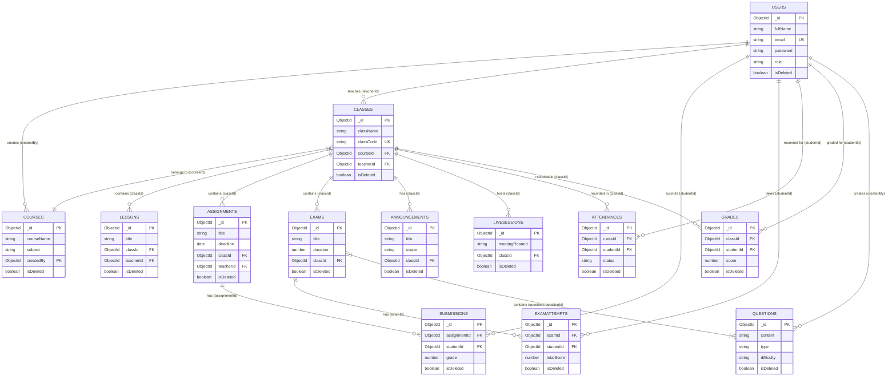

# Tài liệu Thiết kế Cơ sở Dữ liệu & ERD (Database ERD & Schema Document)

Tài liệu mô tả chi tiết kiến trúc Cơ sở Dữ liệu MongoDB cho Hệ thống Quản lý Học tập AI-LMS.

---

## 📑 MỤC LỤC
1. [Tổng quan Kiến trúc Database](#1-tổng-quan-kiến-trúc-database)
2. [Sơ đồ Thực thể Phụ thuộc (Mermaid ER Diagram)](#2-sơ-đồ-thực-thể-phụ-thuộc-mermaid-er-diagram)
3. [Chi tiết Các Collections](#3-chi-tiết-các-collections)
   - [3.1 Collection `users`](#31-collection-users)
   - [3.2 Collection `courses`](#32-collection-courses)
   - [3.3 Collection `classes`](#33-collection-classes)
   - [3.4 Collection `lessons`](#34-collection-lessons)
   - [3.5 Collection `assignments`](#35-collection-assignments)
   - [3.6 Collection `submissions`](#36-collection-submissions)
   - [3.7 Collection `questions`](#37-collection-questions)
   - [3.8 Collection `exams`](#38-collection-exams)
   - [3.9 Collection `examattempts`](#39-collection-examattempts)
   - [3.10 Collection `attendances`](#310-collection-attendances)
   - [3.11 Collection `grades`](#311-collection-grades)
   - [3.12 Collection `announcements`](#312-collection-announcements)
   - [3.13 Collection `livesessions`](#313-collection-livesessions)
4. [Enterprise Soft Delete Plugin Attributes](#4-enterprise-soft-delete-plugin-attributes)

---

## 1. TỔNG QUAN KIẾN TRÚC DATABASE

Hệ thống AI-LMS áp dụng cơ sở dữ liệu **MongoDB (NoSQL)** với ORM **Mongoose 8+**. Tất cả 13 Collections đều áp dụng chuẩn **Enterprise Soft Delete Architecture**, tự động nhúng 3 trường dữ liệu `isDeleted`, `deletedAt`, `deletedBy` và thiết lập Indexes tối ưu cho tốc độ truy vấn cao.

---

## 2. SƠ ĐỒ THỰC THỂ PHỤ THUỘC (MERMAID ER DIAGRAM)

---

## 3. CHI TIẾT CÁC COLLECTIONS

### 3.1 Collection `users`
Lưu trữ toàn bộ tài khoản người dùng trong hệ thống (Admin, Teacher, Student).

| Field | Data Type | Key / Ref | Constraints / Index | Description |
| :--- | :--- | :--- | :--- | :--- |
| `_id` | ObjectId | PK | Auto-generated | Mã định danh duy nhất |
| `fullName` | String | - | Required, Trim, Min 2 | Họ và tên người dùng |
| `email` | String | UK | Required, Unique, Lowercase, Trim, Index | Email đăng nhập |
| `password` | String | - | Required, Hashed bcrypt | Mật khẩu đã mã hóa |
| `role` | String | - | Enum: `["admin", "teacher", "student"]`, Default: `"student"`, Index | Vai trò người dùng |
| `avatar` | String | - | Default: `""` | URL ảnh đại diện |
| `phone` | String | - | Default: `""` | Số điện thoại |
| `status` | String | - | Enum: `["Active", "Inactive", "Locked"]`, Default: `"Active"`, Index | Trạng thái tài khoản |
| `isDeleted` | Boolean | - | Default: `false`, Index | Cờ đánh dấu đã xóa mềm |
| `deletedAt` | Date | - | Default: `null`, Index | Thời điểm xóa mềm |
| `deletedBy` | ObjectId | FK -> `users` | Default: `null` | Người thực hiện xóa |

---

### 3.2 Collection `courses`
Lưu trữ danh mục khóa học chuẩn.

| Field | Data Type | Key / Ref | Constraints / Index | Description |
| :--- | :--- | :--- | :--- | :--- |
| `_id` | ObjectId | PK | Auto-generated | ID khóa học |
| `courseName` | String | - | Required, Trim, Min 3 | Tên khóa học |
| `subject` | String | - | Enum: `["Mathematics", "Physics", "Chemistry", "English", "Literature"]`, Index | Môn học |
| `grade` | Number | - | Min 1, Max 12, Default 12 | Khối lớp |
| `description` | String | - | Default: `""` | Mô tả chi tiết |
| `thumbnail` | String | - | Default: `""` | Ảnh thumbnail |
| `tuitionFee` | Number | - | Min 0, Default 0 | Học phí |
| `status` | String | - | Enum: `["Draft", "Published", "Closed"]`, Default: `"Draft"`, Index | Trạng thái phát hành |
| `createdBy` | ObjectId | FK -> `users` | Required, Index | Người tạo khóa học |
| `isDeleted` | Boolean | - | Default: `false`, Index | Cờ xóa mềm |

---

### 3.3 Collection `classes`
Lưu trữ các lớp học thực tế được mở dựa trên khóa học.

| Field | Data Type | Key / Ref | Constraints / Index | Description |
| :--- | :--- | :--- | :--- | :--- |
| `_id` | ObjectId | PK | Auto-generated | ID lớp học |
| `className` | String | - | Required, Trim, Min 3 | Tên lớp học |
| `classCode` | String | UK | Required, Unique, Uppercase, Trim, Index | Mã lớp học duy nhất |
| `joinCode` | String | UK | Unique, Uppercase, Trim | Mã tham gia lớp |
| `courseId` | ObjectId | FK -> `courses` | Required, Index | Khóa học liên kết |
| `teacherId` | ObjectId | FK -> `users` | Required, Index | Giảng viên phụ trách |
| `maxStudents` | Number | - | Min 1, Max 200, Default 40 | Số học sinh tối đa |
| `currentStudents`| Number | - | Min 0, Default 0 | Số học sinh hiện tại |
| `status` | String | - | Enum: `["Ready", "Active", "Completed", "Closed"]`, Index | Trạng thái lớp |
| `students` | Array[Object] | FK -> `users` | Subdocuments (`studentId`, `status`, `joinedAt`) | Danh sách học sinh enrolled |
| `isDeleted` | Boolean | - | Default: `false`, Index | Cờ xóa mềm |

---

### 3.4 Collection `lessons`
Lưu trữ bài giảng theo từng lớp học.

| Field | Data Type | Key / Ref | Constraints / Index | Description |
| :--- | :--- | :--- | :--- | :--- |
| `_id` | ObjectId | PK | Auto-generated | ID bài giảng |
| `title` | String | - | Required, Trim | Tiêu đề bài giảng |
| `description` | String | - | Trim | Nội dung mô tả |
| `videoUrl` | String | - | Default: `""` | Link video bài giảng |
| `order` | Number | - | Default 0, Index | Thứ tự bài học |
| `classId` | ObjectId | FK -> `classes` | Required, Index | Lớp học sở hữu |
| `teacherId` | ObjectId | FK -> `users` | Required, Index | Giảng viên tạo bài |
| `attachments` | Array[Object]| - | `name`, `url`, `publicId` | Tài liệu đi kèm |
| `isDeleted` | Boolean | - | Default: `false`, Index | Cờ xóa mềm |

---

### 3.5 Collection `assignments`
Lưu trữ bài tập về nhà của lớp.

| Field | Data Type | Key / Ref | Constraints / Index | Description |
| :--- | :--- | :--- | :--- | :--- |
| `_id` | ObjectId | PK | Auto-generated | ID bài tập |
| `title` | String | - | Required, Trim | Tiêu đề bài tập |
| `deadline` | Date | - | Required, Index | Hạn nộp bài |
| `classId` | ObjectId | FK -> `classes` | Required, Index | Lớp học áp dụng |
| `teacherId` | ObjectId | FK -> `users` | Required, Index | Giảng viên ra bài |
| `isAIGenerated` | Boolean | - | Default: `false` | Đánh dấu bài tập AI sinh |
| `aiPromptUsed` | String | - | Default: `null` | Prompt AI đã sử dụng |
| `isDeleted` | Boolean | - | Default: `false`, Index | Cờ xóa mềm |

---

### 3.6 Collection `submissions`
Lưu trữ bài nộp của học sinh.

| Field | Data Type | Key / Ref | Constraints / Index | Description |
| :--- | :--- | :--- | :--- | :--- |
| `_id` | ObjectId | PK | Auto-generated | ID bài nộp |
| `assignmentId` | ObjectId | FK -> `assignments`| Required, Compound UK with `studentId` | Bài tập liên kết |
| `studentId` | ObjectId | FK -> `users` | Required, Index | Học sinh nộp bài |
| `classId` | ObjectId | FK -> `classes` | Required, Index | Lớp học |
| `content` | String | - | Text bài làm | Nội dung bài nộp |
| `grade` | Number | - | Min 0, Max 100, Default `null` | Điểm số đạt được |
| `aiFeedback` | String | - | Phản hồi tự động từ AI | Nhận xét AI |
| `gradedBy` | ObjectId | FK -> `users` | Người chấm điểm | Giảng viên/Admin chấm |
| `isDeleted` | Boolean | - | Default: `false`, Index | Cờ xóa mềm |

---

### 3.7 Collection `questions`
Ngân hàng câu hỏi trắc nghiệm & tự luận.

| Field | Data Type | Key / Ref | Constraints / Index | Description |
| :--- | :--- | :--- | :--- | :--- |
| `_id` | ObjectId | PK | Auto-generated | ID câu hỏi |
| `content` | String | - | Required | Nội dung câu hỏi |
| `type` | String | - | Enum: `["MCQ", "ESSAY"]`, Required | Loại câu hỏi |
| `options` | Array[String]| - | Sử dụng cho MCQ | Các phương án |
| `correctAnswer`| String | - | Sử dụng cho MCQ | Đáp án đúng |
| `difficulty` | String | - | Enum: `["EASY", "MEDIUM", "HARD"]`, Default: `"MEDIUM"` | Độ khó |
| `topic` | String | - | Required | Chủ đề/Chủ điểm |
| `isDeleted` | Boolean | - | Default: `false`, Index | Cờ xóa mềm |

---

### 3.8 Collection `exams`
Danh sách bài thi / đề kiểm tra.

| Field | Data Type | Key / Ref | Constraints / Index | Description |
| :--- | :--- | :--- | :--- | :--- |
| `_id` | ObjectId | PK | Auto-generated | ID đề thi |
| `title` | String | - | Required, Trim | Tiêu đề bài thi |
| `duration` | Number | - | Required (Phút) | Thời gian làm bài |
| `questions` | Array[Object]| FK -> `questions`| `questionId`, `points` (Tổng = 10.0) | Danh sách câu hỏi |
| `classId` | ObjectId | FK -> `classes` | Required, Index | Lớp học làm bài |
| `maxScore` | Number | - | Default: 10 | Điểm tối đa |
| `isDeleted` | Boolean | - | Default: `false`, Index | Cờ xóa mềm |

---

### 3.9 Collection `examattempts`
Bản ghi làm bài thi của học sinh.

| Field | Data Type | Key / Ref | Constraints / Index | Description |
| :--- | :--- | :--- | :--- | :--- |
| `_id` | ObjectId | PK | Auto-generated | ID lượt thi |
| `examId` | ObjectId | FK -> `exams` | Required, Index | Đề thi |
| `studentId` | ObjectId | FK -> `users` | Required, Index | Học sinh thi |
| `status` | String | - | Enum: `["IN_PROGRESS", "SUBMITTED", "GRADED"]` | Trạng thái làm bài |
| `answers` | Array[Object]| - | `questionId`, `selectedOption`, `essayText`, `pointsEarned` | Bài làm chi tiết |
| `totalScore` | Number | - | Default: 0 | Tổng điểm đạt được |
| `cheatCount` | Number | - | Default: 0 | Số lần vi phạm |
| `isDeleted` | Boolean | - | Default: `false`, Index | Cờ xóa mềm |

---

### 3.10 Collection `attendances`
Bản ghi điểm danh theo buổi học.

| Field | Data Type | Key / Ref | Constraints / Index | Description |
| :--- | :--- | :--- | :--- | :--- |
| `_id` | ObjectId | PK | Auto-generated | ID điểm danh |
| `classId` | ObjectId | FK -> `classes` | Required, Compound UK (`classId`, `studentId`, `date`) | Lớp học |
| `studentId` | ObjectId | FK -> `users` | Required, Index | Học sinh |
| `date` | Date | - | Required | Ngày điểm danh |
| `status` | String | - | Enum: `["Present", "Absent", "Late", "Excused"]` | Trạng thái |
| `isDeleted` | Boolean | - | Default: `false`, Index | Cờ xóa mềm |

---

### 3.11 Collection `grades`
Sổ điểm tổng hợp theo cột điểm.

| Field | Data Type | Key / Ref | Constraints / Index | Description |
| :--- | :--- | :--- | :--- | :--- |
| `_id` | ObjectId | PK | Auto-generated | ID cột điểm |
| `studentId` | ObjectId | FK -> `users` | Required, Index | Học sinh |
| `classId` | ObjectId | FK -> `classes` | Required, Index | Lớp học |
| `category` | String | - | Enum: `["Attendance", "Assignment", "Midterm", "Final"]` | Loại cột điểm |
| `score` | Number | - | Min 0, Max 100 | Điểm số |
| `weight` | Number | - | Default: 1 | Hệ số/Tỷ trọng |
| `isDeleted` | Boolean | - | Default: `false`, Index | Cờ xóa mềm |

---

### 3.12 Collection `announcements`
Bảng tin thông báo.

| Field | Data Type | Key / Ref | Constraints / Index | Description |
| :--- | :--- | :--- | :--- | :--- |
| `_id` | ObjectId | PK | Auto-generated | ID thông báo |
| `title` | String | - | Required | Tiêu đề |
| `content` | String | - | Required | Nội dung |
| `scope` | String | - | Enum: `["System", "Course", "Class"]`, Default: `"Class"` | Phạm vi |
| `classId` | ObjectId | FK -> `classes` | Default: `null`, Index | Lớp nhận tin |
| `isDeleted` | Boolean | - | Default: `false`, Index | Cờ xóa mềm |

---

### 3.13 Collection `livesessions`
Quản lý phòng học trực tuyến Live.

| Field | Data Type | Key / Ref | Constraints / Index | Description |
| :--- | :--- | :--- | :--- | :--- |
| `_id` | ObjectId | PK | Auto-generated | ID phòng học |
| `classId` | ObjectId | FK -> `classes` | Required, Index | Lớp học |
| `meetingRoomId`| String | - | Required | Mã phòng học Live |
| `status` | String | - | Enum: `["Scheduled", "Live", "Completed", "Cancelled"]` | Trạng thái Live |
| `isDeleted` | Boolean | - | Default: `false`, Index | Cờ xóa mềm |

---

## 4. ENTERPRISE SOFT DELETE PLUGIN ATTRIBUTES

Tất cả các Collections trên đều áp dụng Mongoose Soft Delete Plugin với 3 thuộc tính đồng nhất:
- `isDeleted`: `{ type: Boolean, default: false, index: true }`
- `deletedAt`: `{ type: Date, default: null, index: true }`
- `deletedBy`: `{ type: Schema.Types.ObjectId, ref: "User", default: null }`
