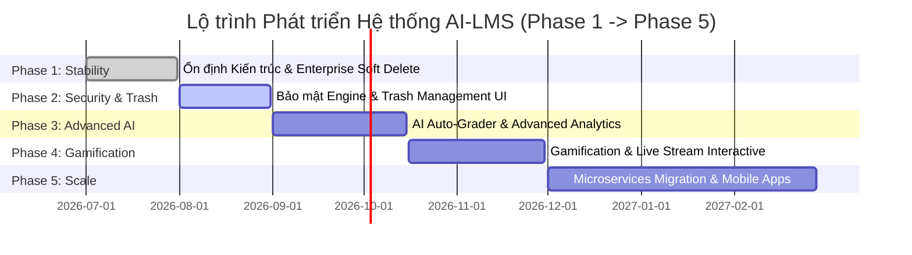

# Đề xuất Lộ trình Phát triển Dự án (Project Development Roadmap)

Tài liệu hoạch định lộ trình nâng cấp và mở rộng toàn diện cho Hệ thống Quản lý Học tập AI-LMS từ Phase 1 đến Phase 5.

---

## 📑 MỤC LỤC
1. [Hiện trạng Dự án (Current Project Status)](#1-hiện-trạng-dự-án-current-project-status)
   - [1.1 Các Phân hệ Đã hoàn thành](#11-các-phân-hệ-đã-hoàn-thành)
   - [1.2 Các Phân hệ Còn thiếu (Gaps)](#12-các-phân-hệ-còn-thiếu-gaps)
2. [Phân tích Nợ Kỹ thuật (Technical Debt Analysis)](#2-phân-tích-nợ-kỹ-thuật-technical-debt-analysis)
3. [Thứ tự Ưu tiên Nâng cấp (Engineering Priorities)](#3-thứ-tự-ưu-tiên-nâng-cấp-engineering-priorities)
   - [3.1 Ưu tiên Refactoring](#31-ưu-tiên-refactoring)
   - [3.2 Ưu tiên Bảo mật (Security)](#32-ưu-tiên-bảo-mật-security)
   - [3.3 Ưu tiên Hiệu năng (Performance)](#33-ưu-tiên-hiệu-năng-performance)
4. [Lộ trình Phát triển 5 Giai đoạn (Roadmap Phase 1 → Phase 5)](#4-lộ-trình-phát-triển-5-giai-đoạn-roadmap-phase-1--phase-5)

---

## 1. HIỆN TRẠNG DỰ ÁN (CURRENT PROJECT STATUS)

### 1.1 Các Phân hệ Đã hoàn thành
- ✅ **Authentication & RBAC**: Đăng ký, đăng nhập JWT, phân quyền 3 vai trò (Admin, Teacher, Student), bảo mật 0 reload SPA.
- ✅ **Enterprise Soft Delete Architecture**: Mongoose Soft Delete Plugin áp dụng đồng nhất trên 100% Collections (`User`, `Course`, `Class`, `Lesson`, `Assignment`, `Submission`, `Question`, `Exam`, `ExamAttempt`, `Attendance`, `Grade`, `Announcement`, `LiveSession`).
- ✅ **Data-Driven Student Dashboard**: Single Source of Truth (`learningDashboardService`), tính toán chỉ số Learning Score, GPA, tỷ lệ chuyên cần và dự báo rủi ro học tập bằng AI.
- ✅ **Class & Course Management**: CRUD khóa học, tạo lớp học, sinh mã joinCode, phân công giảng viên và xếp lớp cho học sinh.
- ✅ **Assignment & Exam Engine**: Giao bài tập, nộp bài kèm file Cloudinary, tạo đề thi tự động validate tổng điểm 10.0, thi trực tuyến và anti-cheat proctoring.

### 1.2 Các Phân hệ Còn thiếu (Gaps)
- ⏳ **Trash & Recycle Bin UI**: Giao diện thùng rác để Admin/Giảng viên xem và khôi phục các mục đã xóa mềm (`Model.restore(id)`).
- ⏳ **AI Automated Code Evaluation**: Chấm bài lập trình tự động (Code Sandbox execution).
- ⏳ **Parent Portal**: Phân hệ dành riêng cho phụ huynh theo dõi tiến độ và điểm số của con.

---

## 2. PHÂN TÍCH NỢ KỸ THUẬT (TECHNICAL DEBT ANALYSIS)

1. **N+1 Query Overhead**: Một số câu lệnh lấy danh sách bài tập/đề thi theo từng lớp còn thực hiện truy vấn lặp trong vòng map.
2. **Missing Token Blacklist**: Chưa tích hợp Redis để thu hồi Token JWT ngay lập tức khi người dùng bấm Đăng xuất.
3. **Lack of Automated E2E Testing**: Thiếu kịch bản test tự động Playwright / Cypress cho luồng thi trực tuyến.

---

## 3. THỨ TỰ ƯU TIÊN NÂNG CẤP (ENGINEERING PRIORITIES)

### 3.1 Ưu tiên Refactoring
1. Tối ưu câu lệnh `$in` MongoDB trong `learningDashboard.service.ts` xóa bỏ N+1 query (`P1`).
2. Đóng gói `cloudinary.service.js` dùng chung cho toàn bộ Backend (`P2`).

### 3.2 Ưu tiên Bảo mật (Security)
1. Thêm `express-rate-limit` chống tấn công Brute-Force tài khoản (`P1`).
2. Xác thực Token JWT khi handshake WebSocket Socket.io (`P2`).

### 3.3 Ưu tiên Hiệu năng (Performance)
1. Thêm Redis Caching Layer lưu cached kết quả thống kê Dashboard (`P2`).
2. Tối ưu hóa kích thước bundle JavaScript Frontend với Vite Code Splitting (`P3`).

---

## 4. LỘ TRÌNH PHÁT TRIỂN 5 GIAI ĐOẠN (ROADMAP PHASE 1 → PHASE 5)

### 📍 Phase 1: Stabilization & Enterprise Architecture Refinement (Đã hoàn tất)
- 🎯 **Mục tiêu**: Ổn định Backend/Frontend, triệt tiêu lỗi 500/Blank screen, tích hợp Enterprise Soft Delete Plugin.
- 🚀 **Kết quả**: 100% hệ thống hoạt động ổn định, 0 lỗi TypeScript, 0 lỗi Syntax Node.js.

### 📍 Phase 2: Security Enhancement & Trash Management (Tháng 8/2026)
- 🎯 **Mục tiêu**: Gia cố bảo mật toàn hệ thống và xây dựng giao diện Thùng rác (Recycle Bin).
- 🚀 **Tính năng**:
  - Tích hợp `express-rate-limit` và Redis Token Blacklist.
  - Xây dựng giao diện Khôi phục dữ liệu đã xóa cho Admin và Giảng viên (`GET /trash`, `PATCH /restore/:id`).

### 📍 Phase 3: Advanced AI Capabilities & Automated Code Sandbox (Tháng 9 - 10/2026)
- 🎯 **Mục tiêu**: Nâng cấp khả năng AI và tích hợp chấm bài lập trình tự động.
- 🚀 **Tính năng**:
  - Chấm bài luận tự động bằng mô hình AI tiên tiến kèm rubric nhận xét chi tiết.
  - Tích hợp Code Execution Engine (Docker Sandbox) hỗ trợ chấm bài tập Python/C++/Java/JavaScript.

### 📍 Phase 4: Gamification & Interactive Live Classroom (Tháng 10 - 11/2026)
- 🎯 **Mục tiêu**: Tăng cường tương tác và học tập chủ động cho học sinh.
- 🚀 **Tính năng**:
  - Hệ thống huy hiệu thành tích (Badges), Bảng xếp hạng (Leaderboard) và Điểm thưởng học tập.
  - Tích hợp Video CallRTC / WebRTC trực tiếp trong lớp học Live Session.

### 📍 Phase 5: Microservices Scaling & Mobile Applications (Tháng 12/2026 - 2/2027)
- 🎯 **Mục tiêu**: Tách các dịch vụ AI/Realtime thành Microservices độc lập và phát hành Ứng dụng Di động.
- 🚀 **Tính năng**:
  - Phát hành ứng dụng Mobile AI-LMS (React Native) cho iOS và Android.
  - Chuyển đổi AI Engine sang Microservice Python/FastAPI để đáp ứng tải lớn.
