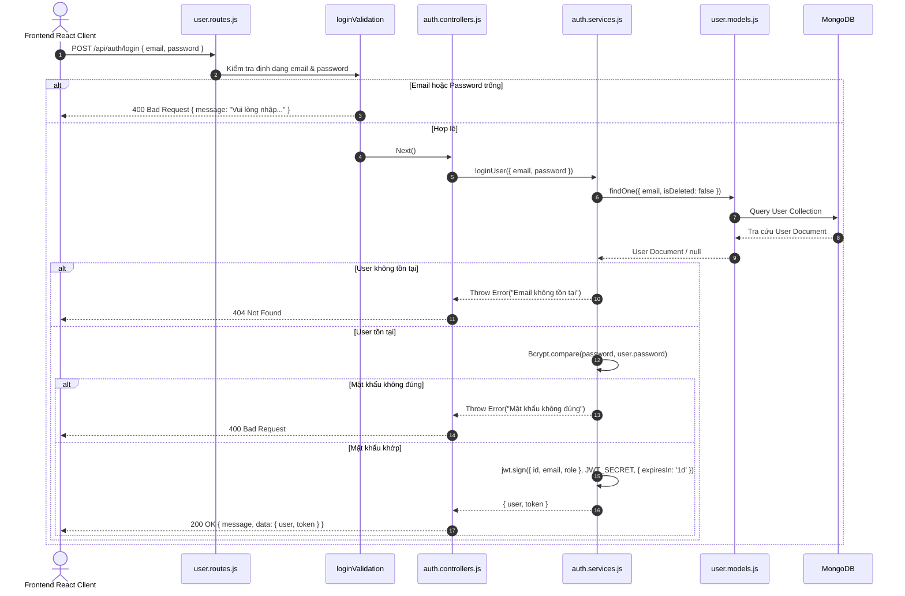
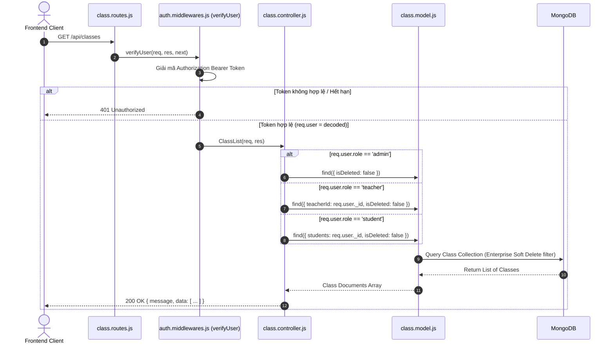
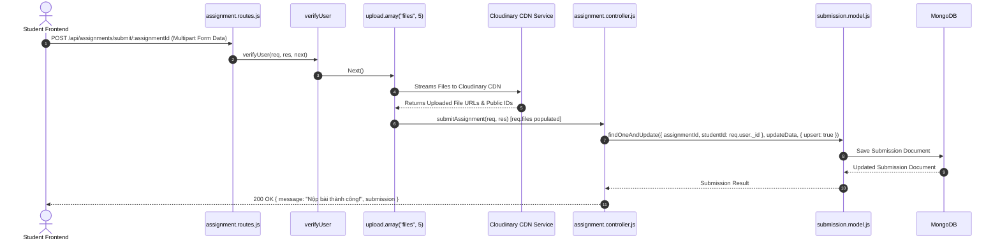
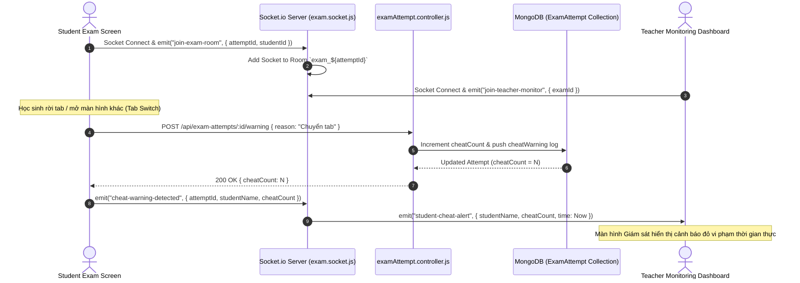
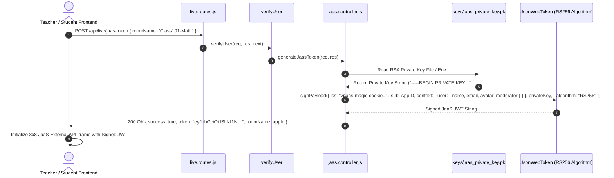

# LUỒNG XỬ LÝ REQUEST VÀ CÁC SƠ ĐỒ TUẦN TỰ (REQUEST FLOW & SEQUENCE DIAGRAMS)

Tài liệu này mô tả chi tiết luồng di chuyển dữ liệu từ Client qua các phân lớp Router ➔ Middleware ➔ Controller ➔ Service ➔ Model ➔ Database / External Services bằng Mermaid Sequence Diagrams.

---

## 📑 MỤC LỤC
1. [Luồng Xử lý 1: Đăng nhập & Xác thực JWT (Authentication Flow)](#1-luồng-xử-lý-1-đăng-nhập--xác-thực-jwt-authentication-flow)
2. [Luồng Xử lý 2: Quản lý Lớp học & Tài nguyên (Class & Material Flow)](#2-luồng-xử-lý-2-quản-lý-lớp-học--tài-nguyên-class--material-flow)
3. [Luồng Xử lý 3: Nộp Bài tập Đa Tệp đính kèm Cloudinary (Assignment Submission Flow)](#3-luồng-xử-lý-3-nộp-bài-tập-đa-tệp-đính-kèm-cloudinary-assignment-submission-flow)
4. [Luồng Xử lý 4: Thi Trực tuyến & Giám sát Gian lận Real-time (Socket.io Proctoring Flow)](#4-luồng-xử-lý-4-thi-trực-tuyến--giám-sát-gian-lận-real-time-socketio-proctoring-flow)
5. [Luồng Xử lý 5: Sinh JWT Mã hóa RS256 cho Lớp học Live 8x8 JaaS (Jitsi Token Flow)](#5-luồng-xử-lý-5-sinh-jwt-mã-hóa-rs256-cho-lớp-học-live-8x8-jaas-jitsi-token-flow)

---

## 1. LUỒNG XỬ LÝ 1: ĐĂNG NHẬP & XÁC THỰC JWT (AUTHENTICATION FLOW)

---

## 2. LUỒNG XỬ LÝ 2: QUẢN LÝ LỚP HỌC & TÀI NGUYÊN (CLASS & MATERIAL FLOW)

---

## 3. LUỒNG XỬ LÝ 3: NỘP BÀI TẬP ĐA TỆP ĐÍNH KÈM CLOUDINARY (ASSIGNMENT SUBMISSION FLOW)

---

## 4. LUỒNG XỬ LÝ 4: THI TRỰC TUYẾN & GIÁM SÁT GIAN LẬN REAL-TIME (SOCKET.IO PROCTORING FLOW)

---

## 5. LUỒNG XỬ LÝ 5: SINH JWT MÃ HÓA RS256 CHO LỚP HỌC LIVE 8X8 JAAS (JITSI TOKEN FLOW)

