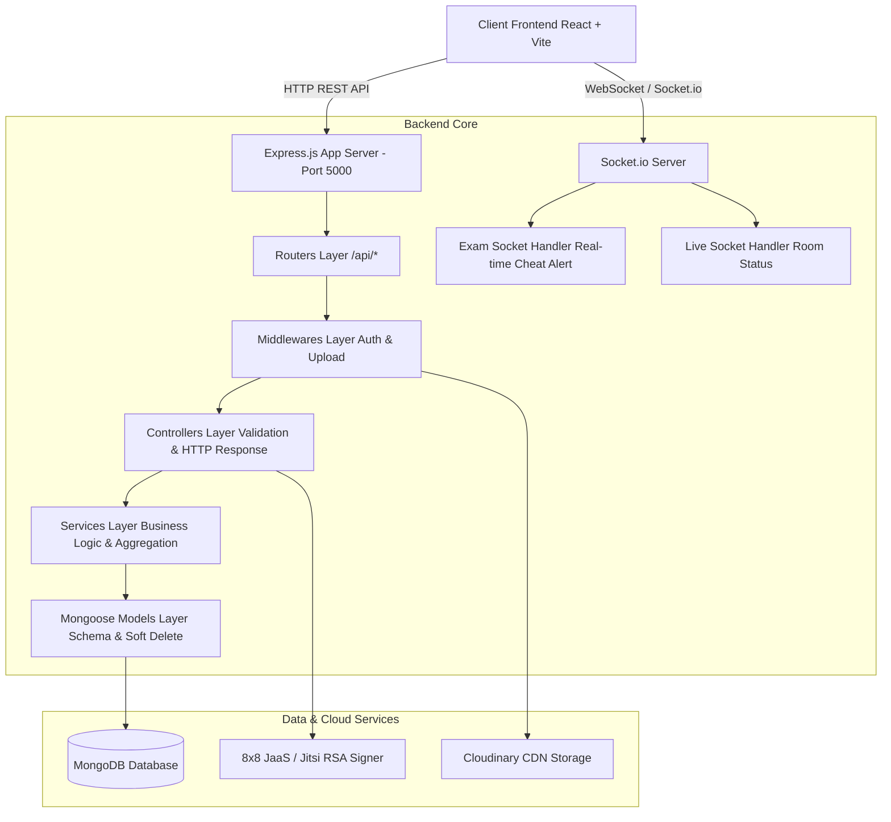
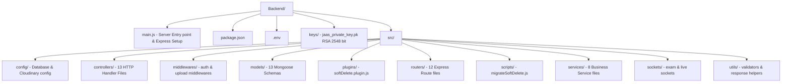
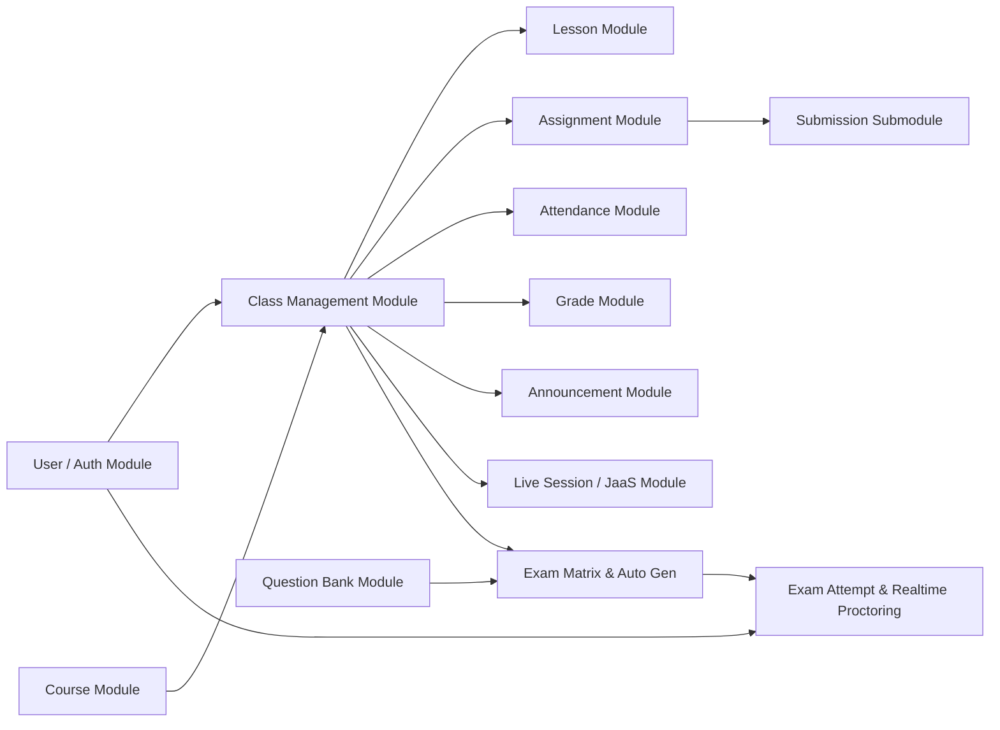

# TÀI LIỆU KIẾN TRÚC BACKEND (BACKEND ARCHITECTURE)

Hệ thống AI LMS (EduSynth AI) Backend được xây dựng trên nền tảng **Node.js**, **Express.js**, **MongoDB**, và **Mongoose ORM**, tích hợp cơ chế xác thực **JWT (JSON Web Token)**, phân quyền **RBAC (Role-Based Access Control)**, giám sát thi thời gian thực qua **Socket.io**, lưu trữ tệp tin trên **Cloudinary**, và tích hợp lớp học trực tuyến qua **8x8 JaaS (Jitsi as a Service)**.

---

## 📑 MỤC LỤC
1. [Tổng quan Kiến trúc (Overall Architecture)](#1-tổng-quan-kiến-trúc-overall-architecture)
2. [Sơ đồ Cấu trúc Thư mục (Folder Structure Diagram)](#2-sơ-đồ-cấu-trúc-thư-mục-folder-structure-diagram)
3. [Sơ đồ Phụ thuộc Module (Module Dependency Diagram)](#3-sơ-đồ-phụ-thuộc-module-module-dependency-diagram)
4. [Sơ đồ Thành phần Chi tiết (Component Diagram)](#4-sơ-đồ-thành-phần-chi-tiết-component-diagram)
5. [Phân tích Chi tiết Thành phần System](#5-phân-tích-chi-tiết-thành-phần-system)
   - [5.1 Layer Architecture & Flow](#51-layer-architecture--flow)
   - [5.2 Controllers & Services Layer](#52-controllers--services-layer)
   - [5.3 Routing & Middleware Layer](#53-routing--middleware-layer)
   - [5.4 Database Models & Enterprise Soft Delete](#54-database-models--enterprise-soft-delete)
   - [5.5 Authentication & Authorization (JWT & RBAC)](#55-authentication--authorization-jwt--rbac)
   - [5.6 Real-time Socket.io Layer](#56-real-time-socketio-layer)
   - [5.7 File Storage & Cloudinary Upload](#57-file-storage--cloudinary-upload)
   - [5.8 Third-party Integrations (8x8 JaaS & Excel)](#58-third-party-integrations-8x8-jaas--excel)
   - [5.9 AI Module & Scheduler Status](#59-ai-module--scheduler-status)

---

## 1. TỔNG QUAN KIẾN TRÚC (OVERALL ARCHITECTURE)

Hệ thống áp dụng mô hình kiến trúc phân lớp chuẩn **MVC / Layered Architecture** (Router ➔ Middleware ➔ Controller ➔ Service ➔ Model ➔ Database), kết hợp với kiến trúc sự kiện thời gian thực (Event-driven Real-time Architecture) phục vụ các tính năng thi cử và trực tuyến.



---

## 2. SƠ ĐỒ CẤU TRÚC THƯ MỤC (FOLDER STRUCTURE DIAGRAM)



---

## 3. SƠ ĐỒ PHỤ THUỘC MODULE (MODULE DEPENDENCY DIAGRAM)



---

## 4. SƠ ĐỒ THÀNH PHẦN CHI TIẾT (COMPONENT DIAGRAM)

```mermaid
componentDefinition
    component BackendServer [Backend Express.js Application] {
        component AuthComponent [Auth & User Control]
        component ClassComponent [Classroom & Material Control]
        component ExamComponent [Question Bank & Exam Generator]
        component AttemptComponent [Exam Execution & Proctoring Engine]
        component LiveComponent [JaaS Video Conferencing Token Engine]
        component AttendanceComponent [Attendance & Grade Tracker]
        component SocketComponent [Real-time Socket Engine]
    }
```

---

## 5. PHÂN TÍCH CHI TIẾT THÀNH PHẦN SYSTEM

### 5.1 Layer Architecture & Flow
Hệ thống xử lý mọi HTTP Request theo thứ tự tuyến tính nghiêm ngặt:
1. **Entry Point (`main.js`)**: Cấu hình CORS (dựa trên `FRONTEND_ORIGINS`), JSON body parser, HTTP Server & Socket.io Server instance.
2. **Router Layer (`src/routers/`)**: Định tuyến URL pattern và chuyển tiếp request.
3. **Middleware Layer (`src/middlewares/`)**:
   - `verifyUser`: Giải mã JWT từ `Authorization: Bearer <token>`, gán thông tin user vào `req.user`.
   - `isAdmin` / `isTeacher`: Kiểm tra vai trò `req.user.role`.
   - `upload.array` / `upload.single`: Xử lý Multipart Form-data qua Multer Cloudinary hoặc Storage Memory.
4. **Controller Layer (`src/controllers/`)**: Trích xuất `req.body`, `req.params`, `req.query`, thực hiện validation, gọi Service hoặc thao tác Direct Model, và trả về JSON chuẩn HTTP Status.
5. **Service Layer (`src/services/`)**: Xử lý logic phức tạp (VD: bốc ngẫu nhiên câu hỏi theo chủ đề và chia điểm trong `exam.service.js`, tính toán tỷ lệ đi học trong `attendance.service.js`).
6. **Model Layer (`src/models/`)**: Định nghĩa Schema, Indexes, Hooks (`pre-save`, `pre-find`), và tích hợp `softDeletePlugin`.

### 5.2 Controllers & Services Layer
Hệ thống hiện tại có 13 Controller files và 8 Service files:
- **Controllers**: `auth.controllers.js`, `class.controller.js`, `course.controller.js`, `lesson.controller.js`, `assignment.controller.js`, `attendance.controller.js`, `grade.controller.js`, `announcement.controller.js`, `question.controller.js`, `exam.controller.js`, `examAttempt.controller.js`, `live.controller.js`, `jaas.controller.js`.
- **Services**: `auth.services.js`, `course.service.js`, `attendance.service.js`, `grade.service.js`, `announcement.service.js`, `question.service.js`, `exam.service.js`, `examAttempt.service.js`.

### 5.3 Routing & Middleware Layer
Toàn bộ API được prefix dưới `/api/`:
- `/api/auth` & `/api/users` ➔ `user.routes.js`
- `/api/classes` ➔ `class.routes.js`
- `/api/courses` ➔ `course.routes.js`
- `/api/lesson` ➔ `lesson.routes.js`
- `/api/assignments` ➔ `assignment.routes.js`
- `/api/attendances` ➔ `attendance.routes.js`
- `/api/grades` ➔ `grade.routes.js`
- `/api/announcements` & `/api/notifications` ➔ `announcement.routes.js`
- `/api/questions` ➔ `question.routes.js`
- `/api/exams` ➔ `exam.routes.js`
- `/api/exam-attempts` ➔ `examAttempt.routes.js`
- `/api/live` ➔ `live.routes.js`

### 5.4 Database Models & Enterprise Soft Delete
Hệ thống quản lý 13 Mongoose Schemas:
`User`, `Course`, `Class`, `Lesson`, `Assignment`, `Submission`, `Question`, `Exam`, `ExamAttempt`, `Attendance`, `Grade`, `Announcement`, `LiveSession`.

Tất cả các Schemas đều được tích hợp **Enterprise Soft Delete Plugin** (`src/plugins/softDelete.plugin.js`):
- Bổ sung 2 trường: `isDeleted: { type: Boolean, default: false }`, `deletedAt: { type: Date, default: null }`.
- Ghi đè các phương thức truy vấn Mongoose: `find`, `findOne`, `findOneAndUpdate`, `countDocuments`, `aggregate` để tự động lọc các bản ghi `isDeleted: false`.
- Cung cấp phương thức `softDelete()` và `restore()`.

### 5.5 Authentication & Authorization (JWT & RBAC)
- **Authentication**: Đăng nhập bằng `email` và `password` (băm với `bcryptjs`). Server sinh **JWT Token** chứa `{ id, email, role }` có thời hạn (expiresIn 1d / 7d). Token được gửi trong Header: `Authorization: Bearer <token>`.
- **RBAC (Role-Based Access Control)**:
  - `Admin`: Có toàn quyền quản trị hệ thống, quản lý tài khoản, tạo khóa học, tạo lớp học, phân công giáo viên/học sinh.
  - `Teacher`: Quản lý lớp được phân công, đăng bài giảng, giao bài tập, tạo đề thi, chấm điểm, điểm danh, phát thông báo, mở phòng học live.
  - `Student`: Xem lớp học, học bài giảng, nộp bài tập, thi trực tuyến thời gian thực, xem điểm cá nhân, xem lịch sử điểm danh.

### 5.6 Real-time Socket.io Layer
Hệ thống sử dụng **Socket.io** tích hợp trực tiếp vào Express HTTP Server:
1. **`exam.socket.js`**:
   - Quản lý phòng thi thời gian thực (`join-exam-room`, `leave-exam-room`).
   - Lắng nghe sự kiện vi phạm gian lận từ sinh viên (`cheat-warning-detected`): chuyển tab, mở window mới, rời chuột khỏi màn hình thi.
   - Phát cảnh báo thời gian thực đến màn hình theo dõi của Giáo viên (`student-cheat-alert`).
   - Tự động nộp bài khi hết giờ thi từ phía Server.
2. **`live.socket.js`**:
   - Theo dõi trạng thái bật/tắt phòng học trực tuyến Jitsi (`join-live-class`, `live-session-status-changed`).

### 5.7 File Storage & Cloudinary Upload
- Tích hợp `multer` và `multer-storage-cloudinary` (`src/config/cloudinary.js`, `src/middlewares/upload.middlewares.js`).
- Hỗ trợ tải lên đa tệp đính kèm (tối đa 5 file/lần upload) cho Bài giảng (`/api/lesson`), Bài tập (`/api/assignments`), và Bài nộp của học sinh (`/api/assignments/submit/:id`).

### 5.8 Third-party Integrations (8x8 JaaS & Excel)
1. **8x8 JaaS (Jitsi as a Service)**:
   - Module `jaas.controller.js` đọc RSA Private Key từ `keys/jaas_private_key.pk` hoặc biến môi trường `JAAS_PRIVATE_KEY`.
   - Sinh JWT Token chuẩn mã hóa RS256 chứa AppID (`vpaas-magic-cookie-...`), thông tin user (`name`, `email`, `avatar`), và quyền hạn phòng họp (`moderator: true` cho Giáo viên, `false` cho Học sinh).
2. **Excel Import (`xlsx`)**:
   - Module `question.controller.js` cho phép Giáo viên tải lên file `.xlsx` / `.xls` chứa danh sách câu hỏi trắc nghiệm / tự luận. Hệ thống parse buffer trực tiếp từ bộ nhớ (`multer.memoryStorage()`) và insert hàng loạt vào DB.

### 5.9 AI Module & Scheduler Status
- **AI Module**: Hiện tại Backend **chưa có** API endpoint gọi trực tiếp LLM (OpenAI / Gemini). Tính năng "AI sinh đề thi tự động" (`/api/exams/generate-auto`) hiện được triển khai bằng thuật toán bốc ngẫu nhiên từ Ngân hàng câu hỏi theo Ma trận đề (`Question.aggregate([{ $match: { type, topic } }, { $sample: { size } }])`) và tự động chia điểm tổng 10.0.
- **Scheduler / Cron Job**: Backend hiện tại **chưa tích hợp** thư viện cron job (`node-cron` hay `agenda`). Các tác vụ tự động khóa đề thi hoặc thông báo chưa có timer tự động chạy ngầm trên Server.
