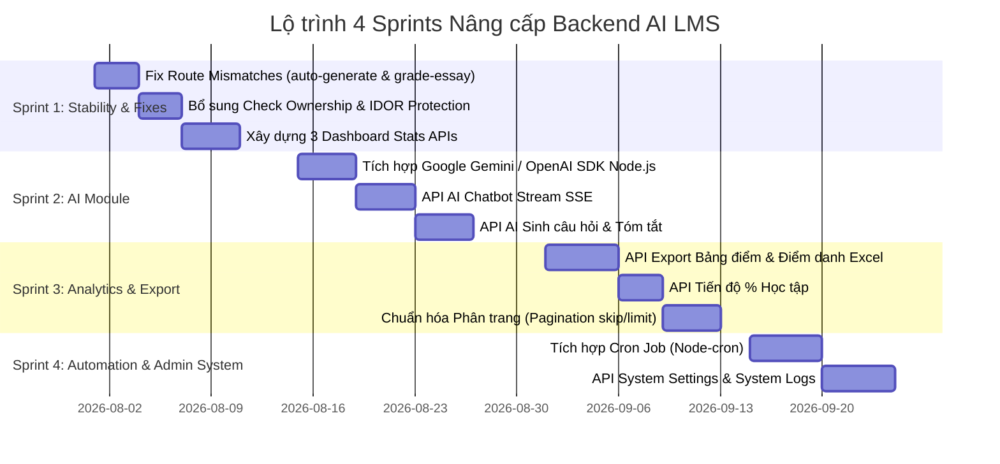

# LỘ TRÌNH PHÁT TRIỂN BACKEND KẾ TIẾP (BACKEND DEVELOPMENT ROADMAP)

Tài liệu này đề xuất kế hoạch hành động chia làm 4 Sprints phát triển Backend AI LMS để hoàn thiện hệ thống 100%.

---

## 📑 MỤC LỤC
1. [Tổng quan Lộ trình 4 Sprints](#1-tổng-quan-lộ-trình-4-sprints)
2. [Sprint 1: Ổn định Hóa & Khắc phục Contract (Stability & Fixes)](#2-sprint-1-ổn-định-hóa--khắc-phục-contract-stability--fixes)
3. [Sprint 2: Xây dựng AI Module Trực tiếp (Direct LLM Integration)](#3-sprint-2-xây-dựng-ai-module-trực-tiếp-direct-llm-integration)
4. [Sprint 3: Báo cáo, Tiến độ & Phân trang (Analytics & Pagination)](#4-sprint-3-báo-cáo-tiến-độ--phân-trang-analytics--pagination)
5. [Sprint 4: Tự động hóa Scheduler & Bảo mật Hệ thống (Automation & Enterprise System)](#5-sprint-4-tự-động-hóa-scheduler--bảo-mật-hệ-thống-automation--enterprise-system)

---

## 1. TỔNG QUAN LỘ TRÌNH 4 SPRINTS

---

## 2. SPRINT 1: ỔN ĐỊNH HÓA & KHẮC PHỤC CONTRACT (STABILITY & FIXES)
- **Thời lượng**: 2 tuần
- **Mục tiêu**: Sửa triệt để các lỗi lệch API Contract gây 404, siết chặt phân quyền RBAC và cung cấp API Dashboard.
- **Danh mục Công việc**:
  1. Thêm Alias Route `POST /api/exams/auto-generate` và `POST /api/exam-attempts/:id/grade-essay`.
  2. Bổ sung Middleware kiểm tra thuộc sở hữu tránh lỗi IDOR cho `GET /api/grades/student/:studentId` và `GET /api/attendances/student/:studentId`.
  3. Xây dựng 3 Endpoints Dashboard: `GET /api/dashboard/admin`, `GET /api/dashboard/teacher`, `GET /api/dashboard/student`.

---

## 3. SPRINT 2: XÂY DỰNG AI MODULE TRỰC TIẾP (DIRECT LLM INTEGRATION)
- **Thời lượng**: 2 tuần
- **Mục tiêu**: Đưa AI trở thành tính năng lõi thực sự trên Backend thay vì thuật toán bốc mẫu ngẫu nhiên.
- **Danh mục Công việc**:
  1. Cài đặt `@google/generative-ai` hoặc `openai` SDK trên Node.js Backend.
  2. Xây dựng `POST /api/ai/chat` hỗ trợ Server-Sent Events (SSE) để phát phản hồi dạng Real-time typing text.
  3. Xây dựng `POST /api/ai/generate-questions` parse tài liệu văn bản thành JSON danh sách câu hỏi.
  4. Xây dựng `POST /api/ai/summarize` cho phép tóm tắt tài liệu và video bài giảng.

---

## 4. SPRINT 3: BÁO CÁO, TIẾN ĐỘ & PHÂN TRANG (ANALYTICS & PAGINATION)
- **Thời lượng**: 2 tuần
- **Mục tiêu**: Hoàn thiện công cụ báo cáo cho Giáo viên/Admin và tối ưu hiệu năng cơ sở dữ liệu.
- **Danh mục Công việc**:
  1. Tích hợp thư viện `exceljs` xây dựng API Export Bảng điểm & Điểm danh dạng `.xlsx`.
  2. Xây dựng API Theo dõi Tiến độ học tập % (`GET /api/progress/student/...`).
  3. Cập nhật `skip` và `limit` vào tất cả các truy vấn `Mongoose.find()` để phân trang kết quả.

---

## 5. SPRINT 4: TỰ ĐỘNG HÓA SCHEDULER & BẢO MẬT HỆ THỐNG (AUTOMATION & ENTERPRISE SYSTEM)
- **Thời lượng**: 2 tuần
- **Mục tiêu**: Tự động hóa quy trình thi cử và quản trị hệ thống chuyên nghiệp.
- **Danh mục Công việc**:
  1. Cài đặt `node-cron` lập lịch tự động kiểm tra và auto-submit các bài thi hết giờ.
  2. Xây dựng API Cấu hình tham số hệ thống (`GET/PUT /api/system/settings`) và xem Log hệ thống (`GET /api/system/logs`).
