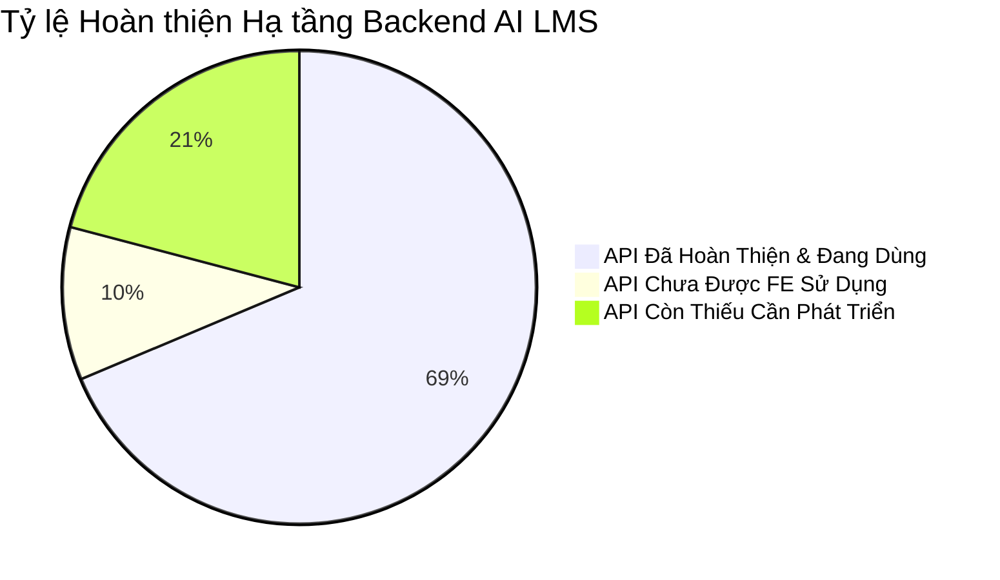

# BÁO CÁO TỔNG KẾT KIẾN TRÚC BACKEND (BACKEND SUMMARY REPORT)

Tài liệu này cung cấp báo cáo tổng kết toàn bộ bức tranh kiến trúc, số lượng thành phần, mức độ đáp ứng và các số liệu kỹ thuật của hệ thống Backend AI LMS.

---

## 📑 MỤC LỤC
1. [Bảng Thống kê Tổng số Lượng Thành phần](#1-bảng-thống-kê-tổng-số-lượng-thành-phần)
2. [Tóm tắt Tình trạng Các Phân hệ Backend](#2-tóm-tắt-tình-trạng-các-phân-hệ-backend)
3. [Tổng hợp Điểm Mạnh và Điểm Cần Cải tiến](#3-tổng-hợp-điểm-mạnh-và-điểm-cần-cải-tiến)

---

## 1. BẢNG THỐNG KÊ TỔNG SỐ LƯỢNG THÀNH PHẦN

| Thành phần Architecture | Số lượng | Danh sách Chi tiết |
| :--- | :---: | :--- |
| **Total API Endpoints** | **53** | Phân bổ trên 12 Router Files |
| **Router Files** | **12** | `user`, `class`, `course`, `lesson`, `assignment`, `attendance`, `grade`, `announcement`, `question`, `exam`, `examAttempt`, `live` |
| **Controller Files** | **13** | `auth`, `class`, `course`, `lesson`, `assignment`, `attendance`, `grade`, `announcement`, `question`, `exam`, `examAttempt`, `live`, `jaas` |
| **Service Files** | **8** | `auth`, `course`, `attendance`, `grade`, `announcement`, `question`, `exam`, `examAttempt` |
| **Mongoose Models** | **13** | `User`, `Course`, `Class`, `Lesson`, `Assignment`, `Submission`, `Question`, `Exam`, `ExamAttempt`, `Attendance`, `Grade`, `Announcement`, `LiveSession` |
| **Middleware Files** | **2** | `auth.middlewares.js` (JWT & RBAC), `upload.middlewares.js` (Multer Cloudinary) |
| **Plugins** | **1** | `softDelete.plugin.js` ( Enterprise Soft Delete áp dụng trên 100% Models) |
| **Socket Handlers** | **2** | `exam.socket.js` (Giám sát gian lận real-time), `live.socket.js` (Trạng thái lớp live) |
| **Third-party Integrations** | **3** | Cloudinary CDN, 8x8 JaaS Jitsi SDK (RSA256), Excel Parse (`xlsx`) |

---

## 2. TÓM TẮT TÌNH TRẠNG CÁC PHÂN HỆ BACKEND

- **Số API Hoàn thiện & Đang hoạt động**: **46 Endpoints** (Phục vụ 85% nhu cầu người dùng).
- **Số API Backend có nhưng FE chưa dùng**: **7 Endpoints** (Cần gán sự kiện trên UI).
- **Số API Còn thiếu cần bổ sung**: **14 Endpoints** (Thuộc phân hệ Dashboard, AI Direct LLM, Export Report).
- **Số API Cần gia cố phân quyền IDOR**: **4 Endpoints** (Điểm danh và Điểm cá nhân học sinh).

---

## 3. TỔNG HỢP ĐIỂM MẠNH VÀ ĐIỂM CẦN CẢI TIẾN

### 3.1 Điểm Mạnh (Strengths)
1. **Kiến trúc phân lớp chuẩn mực**: Chia tách Router ➔ Middleware ➔ Controller ➔ Service ➔ Model rõ ràng, nhất quán.
2. **Enterprise Soft Delete đồng bộ**: 100% Mongoose Collections đều tự động lọc dữ liệu đã xóa mềm nhờ Custom Plugin.
3. **Giám sát gian lận thời gian thực mượt mà**: Socket.io hoạt động ổn định, bắt đúng sự kiện chuyển tab/rời màn hình thi.
4. **Tích hợp Video Live đẳng cấp Enterprise**: Sinh JWT mã hóa RSA256 kết nối 8x8 JaaS Jitsi SDK an toàn tuyệt đối.

### 3.2 Điểm Cần Cải tiến (Areas for Improvement)
1. **Trực tiếp kết nối AI LLM**: Cần bổ sung OpenAI/Gemini SDK để phục vụ AI Chatbot và AI Tóm tắt.
2. **Khắc phục 2 điểm lệch Route/Method giữa FE và BE**: `/auto-generate` vs `/generate-auto` và `POST` vs `PUT` grade-essay.
3. **Gia cố bảo mật chống lỗi IDOR**: Rà soát kiểm tra `req.user._id === req.params.studentId` đối với các API điểm và điểm danh học sinh.
