# SƠ ĐỒ ÁNH XẠ DỮ LIỆU TỪ MODEL ĐẾN FRONTEND (DATABASE MAPPING)

Tài liệu này chi tiết hóa mối liên kết giữa các Mongoose Models trong Database ➔ API Endpoints ➔ Controllers ➔ Services ➔ Frontend Components.

---

## 📑 MỤC LỤC
1. [Sơ đồ Ánh xạ Tổng quan (Database Mapping Diagram)](#1-sơ-đồ-ánh-xạ-tổng-quan-database-mapping-diagram)
2. [Bảng Ánh xạ Chi tiết 13 Collections](#2-bảng-ánh-xạ-chi-tiết-13-collections)
3. [Phân tích Schema & Chỉ mục Search (Indexes)](#3-phân-tích-schema--chỉ-mục-search-indexes)

---

## 1. SƠ ĐỒ ÁNH XẠ TỔNG QUAN (DATABASE MAPPING DIAGRAM)

```mermaid
graph TD
    subgraph Database Models Layer
        M_User[User Model]
        M_Course[Course Model]
        M_Class[Class Model]
        M_Lesson[Lesson Model]
        M_Assignment[Assignment Model]
        M_Submission[Submission Model]
        M_Question[Question Model]
        M_Exam[Exam Model]
        M_ExamAttempt[ExamAttempt Model]
        M_Attendance[Attendance Model]
        M_Grade[Grade Model]
        M_Announcement[Announcement Model]
        M_LiveSession[LiveSession Model]
    end

    subgraph API Controller Layer
        C_Auth[auth.controllers.js]
        C_Course[course.controller.js]
        C_Class[class.controller.js]
        C_Lesson[lesson.controller.js]
        C_Assignment[assignment.controller.js]
        C_Question[question.controller.js]
        C_Exam[exam.controller.js]
        C_Attempt[examAttempt.controller.js]
        C_Attendance[attendance.controller.js]
        C_Grade[grade.controller.js]
        C_Announcement[announcement.controller.js]
        C_Live[live.controller.js]
    end

    subgraph Frontend Components Layer
        FE_Account[AccountManagementPage]
        FE_Course[CourseManagementPage]
        FE_Class[ClassManagementPage / MyClasses]
        FE_Lesson[LessonView / LearningMaterialsTab]
        FE_Assignment[StudentAssignment / TeacherAssignmentsTab]
        FE_Submission[TeacherSubmissionsDrawer / GradeSubmissionModal]
        FE_Question[QuestionBank / CreateExamWizardDrawer]
        FE_Exam[ExamList / ExamResults]
        FE_ExamPage[ExamPage / ExamAttemptDetail]
        FE_Attendance[AttendanceTable / AttendanceTimeline]
        FE_Grade[GradeTable / GradeOverview]
        FE_Announcement[AnnouncementFeed / NotificationCenterPage]
        FE_Live[CurrentLiveCard / TeacherLiveSessionWidget]
    end

    M_User --> C_Auth --> FE_Account
    M_Course --> C_Course --> FE_Course
    M_Class --> C_Class --> FE_Class
    M_Lesson --> C_Lesson --> FE_Lesson
    M_Assignment --> C_Assignment --> FE_Assignment
    M_Submission --> C_Assignment --> FE_Submission
    M_Question --> C_Question --> FE_Question
    M_Exam --> C_Exam --> FE_Exam
    M_ExamAttempt --> C_Attempt --> FE_ExamPage
    M_Attendance --> C_Attendance --> FE_Attendance
    M_Grade --> C_Grade --> FE_Grade
    M_Announcement --> C_Announcement --> FE_Announcement
    M_LiveSession --> C_Live --> FE_Live
```

---

## 2. BẢNG ÁNH XẠ CHI TIẾT 13 COLLECTIONS

| Mongoose Model | File Schema Backend | API Endpoint Chính | Controller Handling | Service Handling | Frontend Component Tiêu biểu |
| :--- | :--- | :--- | :--- | :--- | :--- |
| **`User`** | `src/models/user.models.js` | `/api/auth/*`, `/api/users/*` | `auth.controllers.js` | `auth.services.js` | `AccountManagementPage`, `StudentHeader`, `TeacherHeader` |
| **`Course`** | `src/models/course.model.js` | `/api/courses/*` | `course.controller.js` | `course.service.js` | `CourseManagementPage`, `CourseFormModal` |
| **`Class`** | `src/models/class.model.js` | `/api/classes/*` | `class.controller.js` | Direct Model | `ClassManagementPage`, `MyClasses`, `TeacherClassroomsGrid`, `ClassDetail` |
| **`Lesson`** | `src/models/lesson.model.js` | `/api/lesson/*` | `lesson.controller.js` | Direct Model | `LessonView`, `TeacherMaterialsTab`, `LearningMaterialsTab` |
| **`Assignment`** | `src/models/assignment.model.js` | `/api/assignments/*` | `assignment.controller.js` | Direct Model | `StudentAssignment`, `TeacherAssignmentsTab`, `AssignmentList` |
| **`Submission`** | `src/models/submission.model.js` | `/api/assignments/submit/*`, `/api/assignments/grade/*` | `assignment.controller.js` | Direct Model | `TeacherSubmissionsDrawer`, `GradeSubmissionModal`, `AssignmentSubmissionCard` |
| **`Question`** | `src/models/question.model.js` | `/api/questions/*` | `question.controller.js` | `question.service.js` | `QuestionBank`, `QuestionFormDrawer`, `CreateExamWizardDrawer` |
| **`Exam`** | `src/models/exam.model.js` | `/api/exams/*` | `exam.controller.js` | `exam.service.js` | `ExamList`, `CreateExamWizardDrawer`, `ExamResults` |
| **`ExamAttempt`** | `src/models/examAttempt.model.js` | `/api/exam-attempts/*` | `examAttempt.controller.js` | `examAttempt.service.js` | `ExamPage`, `ExamAttemptDetail`, `ExamReviewDrawer` |
| **`Attendance`** | `src/models/attendance.model.js` | `/api/attendances/*` | `attendance.controller.js` | `attendance.service.js` | `AttendanceTable`, `AttendanceTimeline`, `AttendanceReport` |
| **`Grade`** | `src/models/grade.model.js` | `/api/grades/*` | `grade.controller.js` | `grade.service.js` | `GradeTable`, `GradeOverview` |
| **`Announcement`**| `src/models/announcement.model.js` | `/api/announcements/*`, `/api/notifications/*` | `announcement.controller.js` | `announcement.service.js` | `AnnouncementFeed`, `AnnouncementsTimelineWidget`, `NotificationCenterPage` |
| **`LiveSession`** | `src/models/liveSession.model.js` | `/api/live/*` | `live.controller.js`, `jaas.controller.js` | Direct Model | `CurrentLiveCard`, `TeacherLiveSessionWidget`, `ClassDetail` (Tab Live) |

---

## 3. PHÂN TÍCH SCHEMA & CHỈ MỤC SEARCH (INDEXES)

- Tất cả 13 Schemas đều tự động bổ sung 2 trường `isDeleted` và `deletedAt` nhờ `softDeletePlugin`.
- Các ngoại khóa `ObjectId` được tham chiếu đúng định dạng Mongoose `ref`:
  - `Class.teacherId` ➔ `User`
  - `Class.students` ➔ `[User]`
  - `Class.courseId` ➔ `Course`
  - `Submission.studentId` ➔ `User`
  - `ExamAttempt.studentId` ➔ `User`
  - `ExamAttempt.examId` ➔ `Exam`
