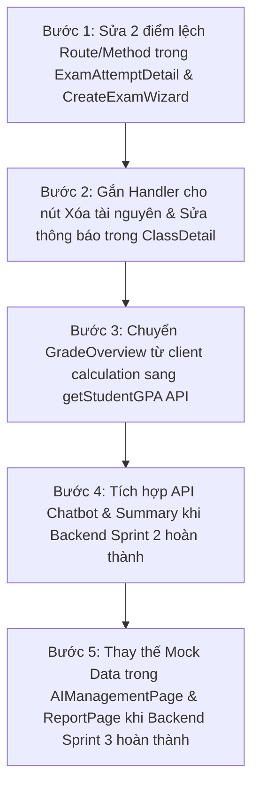

# PHÂN TÍCH KHOẢNG TRỐNG VÀ ĐỀ XUẤT REFACTOR FRONTEND (FRONTEND GAP ANALYSIS)

Tài liệu này đánh giá chi tiết các khoảng trống kỹ thuật ở tầng Frontend (Mock Data, trùng lặp Route, Component cần Refactor, và thứ tự ưu tiên tích hợp Backend).

---

## 📑 MỤC LỤC
1. [Danh sách Trang Đang Sử dụng Dữ liệu Giả (Mock Data)](#1-danh-sách-trang-đang-sử-dụng-dữ-liệu-giả-mock-data)
2. [Phân tích Trùng lặp Route & Legacy Code](#2-phân-tích-trùng-lập-route--legacy-code)
3. [Danh sách Components Cần Refactor Tích hợp Backend](#3-danh-sách-components-cần-refactor-tích-hợp-backend)
4. [Lộ trình Ưu tiên Tích hợp Frontend (Integration Roadmap)](#4-lộ-trình-ưu-tiên-tích-hợp-frontend-integration-roadmap)

---

## 1. DANH SÁCH TRANG ĐANG SỬ DỤNG DỮ LIỆU GIẢ (MOCK DATA)

| Trang Frontend | File Source Code | File Mock Sử dụng | Ghi chú & Tác hại |
| :--- | :--- | :--- | :--- |
| **Quản lý AI (Admin)** | `src/features/aiManagement/AIManagementPage.tsx` | `src/features/aiManagement/mock/features.mock.ts` | Hiển thị bảng AI Models & Prompts từ mảng JS tĩnh. Chưa thể lưu cấu hình thực tế. |
| **Báo cáo (Admin)** | `src/pages/Report/ReportPage.tsx` | `src/features/aiManagement/mock/features.mock.ts` | Biểu đồ tần suất sử dụng AI và dung lượng storage là số liệu tĩnh. |
| **Notification Center**| `src/pages/students/NotificationCenterPage.tsx` | `src/api/notificationApi.ts` (`initialNotificationsMock`) | Khi Server trả về mảng rỗng hoặc lỗi kết nối, FE fallback về 6 thông báo giả. |

---

## 2. PHÂN TÍCH TRÙNG LẶP ROUTE & LEGACY CODE

Trong file [App.tsx](file:///e:/AI-LMS/Frontend/src/App.tsx), đang tồn tại các Tuyến đường trùng lặp phục vụ tương thích ngược:

```typescript
{/* Tuyến đường /student làm prefix chính */}
<Route path="/student" element={<HomeLayoutStudent />}>
  <Route index element={<HomePageStudent />} />
  <Route path="myclasses" element={<MyClasses />} />
  <Route path="studentassignment" element={<StudentAssignment />} />
  <Route path="classdetail/:classId" element={<ClassDetail />} />
</Route>

{/* Tuyến đường / giữ tương thích ngược (Duplicate) */}
<Route path="/" element={<HomeLayoutStudent />}>
  <Route index element={<HomePageStudent />} />
  <Route path="myclasses" element={<MyClasses />} />
  <Route path="studentassignment" element={<StudentAssignment />} />
  <Route path="classdetail/:classId" element={<ClassDetail />} />
</Route>
```

- **Đánh giá**: Cần thực hiện Redirect từ `/` sang `/student/dashboard` thay vì khai báo song song 2 cây Route giống hệt nhau để tránh phân tán trạng thái URL và SEO routing.

---

## 3. DANH SÁCH COMPONENTS CẦN REFACTOR TÍCH HỢP BACKEND

1. **`ExamAttemptDetail.tsx` (Chấm thi tự luận)**:
   - **Tình trạng**: Đang gọi `POST /api/exam-attempts/:id/grade-essay`.
   - **Cần sửa**: Chuyển HTTP Method sang `PUT` (hoặc cấu hình Backend hỗ trợ cả 2).
2. **`CreateExamWizardDrawer.tsx` (Sinh đề thi tự động)**:
   - **Tình trạng**: Đang gọi `POST /api/exams/auto-generate`.
   - **Cần sửa**: Đổi URL Endpoint thành `/api/exams/generate-auto`.
3. **`GradeOverview.tsx` (Bảng tổng kết GPA)**:
   - **Tình trạng**: Đang tự nhân hệ số điểm ở Client.
   - **Cần sửa**: Gọi API `gradeApi.getStudentGPA(classId, studentId)` để lấy điểm chính xác từ Backend Service.
4. **`ClassDetail.tsx` (Tab Tài nguyên & Tab Thông báo)**:
   - **Tình trạng**: Chưa gắn handler cho sự kiện Xóa tài nguyên (`classApi.removeResource`) và Sửa thông báo (`announcementApi.updateAnnouncement`).

---

## 4. LỘ TRÌNH ƯU TIÊN TÍCH HỢP FRONTEND (INTEGRATION ROADMAP)


