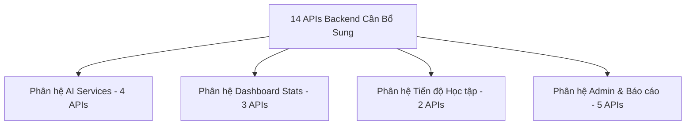

# PHÂN TÍCH VÀ ĐỀ XUẤT API CÒN THIẾU (MISSING API ANALYSIS)

Tài liệu này tổng hợp toàn bộ các API Backend còn thiếu để đáp ứng 100% nhu cầu nghiệp vụ của hệ thống AI LMS.

---

## 📑 MỤC LỤC
1. [Danh sách API Còn Thiếu Theo Phân Hệ](#1-danh-sách-api-còn-thiếu-theo-phân-hệ)
2. [Đề xuất Chi tiết Thiết kế Endpoint](#2-đề-xuất-chi-tiết-thiết-kế-endpoint)
   - [2.1 Phân hệ AI & LLM Services](#21-phân-hệ-ai--llm-services)
   - [2.2 Phân hệ Dashboard & Analytics](#22-phân-hệ-dashboard--analytics)
   - [2.3 Phân hệ Progress & Student Tracking](#23-phân-hệ-progress--student-tracking)
   - [2.4 Phân hệ Admin System & Reports](#24-phân-hệ-admin-system--reports)
3. [Bảng Ma Trận Đặt Ưu Tiên Phát Triển (Priority Roadmap)](#3-bảng-ma-trận-đặt-ưu-tiên-phát-triển-priority-roadmap)

---

## 1. DANH SÁCH API CÒN THIẾU THEO PHÂN HỆ

Toàn bộ hệ thống hiện đang thiếu **14 Endpoints chính**:



---

## 2. ĐỀ XUẤT CHI TIẾT THIẾT KẾ ENDPOINT

### 2.1 Phân hệ AI & LLM Services

#### 1. `POST /api/ai/chat` (AI Chatbot Trợ lý học tập)
- **Role**: Student, Teacher
- **Request Payload**:
  ```json
  {
    "message": "Giải thích giúp em thuật toán Binary Search",
    "context": { "classId": "65a1234...", "lessonId": "65b9876..." }
  }
  ```
- **Response Data**: Stream Server-Sent Events (SSE) hoặc JSON response text.
- **Độ ưu tiên**: 🔴 HIGH

#### 2. `POST /api/ai/summarize` (AI Tóm tắt Bài giảng / Tài liệu)
- **Role**: Teacher, Student
- **Request Payload**: `{ "lessonId": "65b9876...", "maxLength": 300 }`
- **Response Data**: `{ "summary": "Nội dung bài giảng gồm 3 phần chính...", "keyPoints": [...] }`
- **Độ ưu tiên**: 🟡 MEDIUM

#### 3. `POST /api/ai/generate-questions` (AI Tạo câu hỏi từ tài liệu)
- **Role**: Teacher
- **Request Payload**: `{ "topic": "Node.js Core", "mcqCount": 5, "essayCount": 2, "difficulty": "MEDIUM" }`
- **Response Data**: `{ "questions": [ { "content": "...", "options": [...], "correctAnswer": "A" } ] }`
- **Độ ưu tiên**: 🔴 HIGH

#### 4. `GET/PUT /api/admin/ai-config` (Admin Quản lý Cấu hình AI)
- **Role**: Admin
- **Request Payload**: `{ "provider": "OpenAI", "apiKey": "sk-...", "defaultModel": "gpt-4o" }`
- **Response Data**: `{ "success": true, "updatedAt": "2026-07-27..." }`
- **Độ ưu tiên**: 🟡 MEDIUM

---

### 2.2 Phân hệ Dashboard & Analytics

#### 5. `GET /api/dashboard/admin` (Thống kê Tổng quan Admin)
- **Role**: Admin
- **Response Data**:
  ```json
  {
    "totalUsers": 1250,
    "activeTeachers": 45,
    "activeStudents": 1185,
    "totalClasses": 32,
    "totalCourses": 18,
    "systemHealth": "99.9%"
  }
  ```
- **Độ ưu tiên**: 🔴 HIGH

#### 6. `GET /api/dashboard/teacher` (Thống kê Tổng quan Giáo viên)
- **Role**: Teacher
- **Response Data**:
  ```json
  {
    "assignedClassesCount": 4,
    "pendingGradingSubmissions": 12,
    "upcomingExams": 2,
    "activeLiveSessions": 1
  }
  ```
- **Độ ưu tiên**: 🔴 HIGH

#### 7. `GET /api/dashboard/student` (Thống kê Widget Sinh viên)
- **Role**: Student
- **Response Data**:
  ```json
  {
    "enrolledClassesCount": 5,
    "pendingAssignmentsCount": 3,
    "upcomingExams": [ ... ],
    "gpaAverage": 8.65
  }
  ```
- **Độ ưu tiên**: 🔴 HIGH

---

### 2.3 Phân hệ Progress & Student Tracking

#### 8. `GET /api/progress/student/:studentId/class/:classId` (Tiến độ học tập cá nhân)
- **Role**: Student, Teacher
- **Response Data**: `{ "completedLessons": 8, "totalLessons": 10, "completionRate": 80.0 }`
- **Độ ưu tiên**: 🟡 MEDIUM

#### 9. `POST /api/progress/mark-lesson-complete` (Đánh dấu hoàn thành bài học)
- **Role**: Student
- **Request Payload**: `{ "lessonId": "65b9876...", "classId": "65a1234..." }`
- **Response Data**: `{ "success": true, "newProgress": 85.0 }`
- **Độ ưu tiên**: 🟡 MEDIUM

---

### 2.4 Phân hệ Admin System & Reports

#### 10. `GET /api/reports/export/grades/:classId` (Xuất Bảng điểm Excel/PDF)
- **Role**: Admin, Teacher
- **Query Params**: `format=excel|pdf`
- **Response Data**: Binary File Buffer Stream (`Content-Type: application/vnd.openxmlformats...`)
- **Độ ưu tiên**: 🟡 MEDIUM

#### 11. `GET /api/reports/export/attendance/:classId` (Xuất Báo cáo Điểm danh Excel/PDF)
- **Role**: Admin, Teacher
- **Query Params**: `format=excel|pdf`
- **Response Data**: Binary File Buffer Stream
- **Độ ưu tiên**: 🟡 MEDIUM

#### 12. `GET/PUT /api/system/settings` (Cấu hình Tham số Hệ thống)
- **Role**: Admin
- **Response Data**: `{ "siteName": "EduSynth AI LMS", "maxFileUploadMB": 50, "allowStudentRegistration": true }`
- **Độ ưu tiên**: 🟢 LOW

#### 13. `GET /api/system/logs` (Xem Log Hệ thống)
- **Role**: Admin
- **Response Data**: `{ "logs": [ { "timestamp": "...", "level": "ERROR", "message": "..." } ] }`
- **Độ ưu tiên**: 🟢 LOW

#### 14. `POST /api/notifications/send-bulk` (Gửi Thông báo Hàng loạt)
- **Role**: Admin
- **Request Payload**: `{ "targetRole": "student", "title": "Bảo trì", "content": "..." }`
- **Response Data**: `{ "sentCount": 1185 }`
- **Độ ưu tiên**: 🟡 MEDIUM

---

## 3. BẢNG MA TRẬN ĐẶT ƯU TIÊN PHÁT TRIỂN (PRIORITY ROADMAP)

| Endpoint | Chức năng | Phân hệ | Vai trò | Độ ưu tiên | Sprint đề xuất |
| :--- | :--- | :--- | :---: | :---: | :---: |
| `GET /api/dashboard/admin` | Thống kê Admin Dashboard | Dashboard | Admin | 🔴 HIGH | Sprint 1 |
| `GET /api/dashboard/teacher` | Thống kê Teacher Dashboard | Dashboard | Teacher | 🔴 HIGH | Sprint 1 |
| `GET /api/dashboard/student` | Thống kê Student Dashboard | Dashboard | Student | 🔴 HIGH | Sprint 1 |
| `POST /api/ai/chat` | AI Chatbot giải đáp học tập | AI | Student | 🔴 HIGH | Sprint 2 |
| `POST /api/ai/generate-questions` | AI Sinh câu hỏi đề thi | AI | Teacher | 🔴 HIGH | Sprint 2 |
| `GET/PUT /api/admin/ai-config` | Cấu hình AI Provider | AI | Admin | 🟡 MEDIUM | Sprint 2 |
| `POST /api/ai/summarize` | AI Tóm tắt nội dung | AI | Teacher/Student | 🟡 MEDIUM | Sprint 2 |
| `GET /api/progress/student/...` | Xem tiến độ học tập % | Progress | Student | 🟡 MEDIUM | Sprint 3 |
| `POST /api/progress/mark-lesson` | Đánh dấu học xong bài | Progress | Student | 🟡 MEDIUM | Sprint 3 |
| `GET /api/reports/export/grades` | Xuất file Bảng điểm | Report | Admin/Teacher | 🟡 MEDIUM | Sprint 3 |
| `GET /api/reports/export/attendance`| Xuất file Điểm danh | Report | Admin/Teacher | 🟡 MEDIUM | Sprint 3 |
| `POST /api/notifications/send-bulk` | Gửi thông báo hệ thống | Notification | Admin | 🟡 MEDIUM | Sprint 3 |
| `GET/PUT /api/system/settings` | Cấu hình hệ thống | System | Admin | 🟢 LOW | Sprint 4 |
| `GET /api/system/logs` | Log lỗi hệ thống | System | Admin | 🟢 LOW | Sprint 4 |
