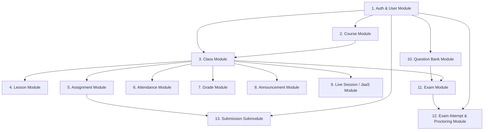

# SƠ ĐỒ SỰ PHỤ THUỘC GIỮA CÁC MODULE (MODULE DEPENDENCY DIAGRAM)

Tài liệu này thể hiện mối quan hệ phụ thuộc lẫn nhau giữa các phân hệ dữ liệu trong Backend AI LMS bằng sơ đồ Mermaid.

---

## 📑 MỤC LỤC
1. [Sơ đồ Phụ thuộc Module Tổng thể](#1-sơ-đồ-phụ-thuộc-module-tổng-thể)
2. [Chi tiết Luồng Dữ liệu Phụ thuộc](#2-chi-tiết-luồng-dữ-liệu-phụ-thuộc)

---

## 1. SƠ ĐỒ PHỤ THUỘC MODULE TỔNG THỂ

---

## 2. CHI TIẾT LUỒNG DỮ LIỆU PHỤ THUỘC

1. **`User` (Gốc)**: Đóng vai trò thực thể trung tâm. Mọi thao tác từ tạo lớp, tạo bài tập, nộp bài, thi cử, điểm danh đến thông báo đều phụ thuộc vào `userId` (Admin, Teacher, Student).
2. **`Course` & `Class` (Quản trị)**: `Course` là khung chương trình, `Class` là thực thể triển khai chứa danh sách `students` và `teacherId`.
3. **`Lesson`, `Assignment`, `Attendance`, `Grade`, `Announcement`, `LiveSession`**: Đều gắn trực tiếp với `classId`. Nếu `Class` bị xóa (hoặc soft delete), các tài nguyên này bị cô lập.
4. **`Question` ➔ `Exam` ➔ `ExamAttempt`**: Ngân hàng câu hỏi `Question` cung cấp dữ liệu cho `Exam` (bốc ngẫu nhiên qua thuật toán Matrix trong `exam.service.js`). Khi sinh viên thi, lượt thi `ExamAttempt` được khởi tạo tham chiếu tới cả `examId` và `studentId`.
5. **`Assignment` ➔ `Submission`**: Bài tập `Assignment` quản lý các bài nộp `Submission` của từng sinh viên.
