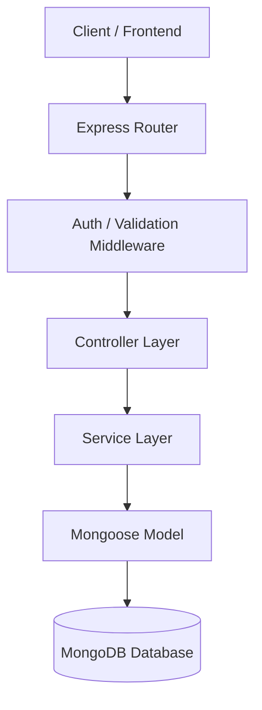
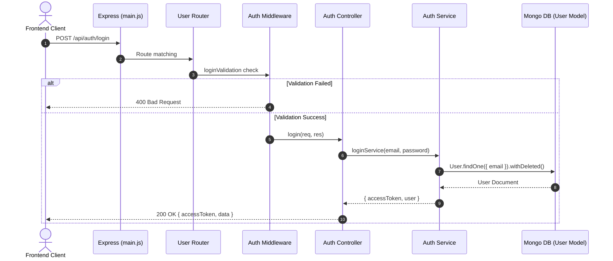

# 🏗️ Phân Tích & Đánh Giá Kiến Trúc Hệ Thống (Architecture Review)

**Dự án:** Hệ thống Quản lý Học tập AI (AI LMS Backend)  
**Tác giả audit:** Principal Backend Architect & Technical Auditor  
**Ngày đánh giá:** 28/07/2026  

---

## 📑 Mục Lục
1. [Tổng Quan Kiến Trúc](#1-tổng-quan-kiến-trúc)
2. [Đánh Giá Cấu Trúc Thư Mục (Folder Structure)](#2-đánh-giá-cấu-trúc-thư-mục-folder-structure)
3. [Đánh Giá Mô Hình MVC & Tách Lớp (Layered Architecture)](#3-đánh-giá-mô-hình-mvc--tách-lớp-layered-architecture)
4. [Đánh Giá Chi Tiết Theo Từng Thành Phần](#4-đánh-giá-chi-tiết-theo-từng-thành-phần)
   - [Controllers](#41-controllers)
   - [Services](#42-services)
   - [Models](#43-models)
   - [Routers](#44-routers)
   - [Middlewares](#45-middlewares)
   - [Plugins](#46-plugins)
   - [Utils & Helpers](#47-utils--helpers)
5. [Sơ Đồ Luồng Dữ Liệu & Phân Ranh Giới Kiến Trúc](#5-sơ-đồ-luồng-dữ-liệu--phân-ranh-giới-kiến-trúc)
6. [Bảng Tổng Hợp Đánh Giá Kỹ Thuật (Architecture Scorecard)](#6-bảng-tổng-hợp-đánh-giá-kỹ-thuật-architecture-scorecard)
7. [Khuyến Nghị Cải Tiến Dài Hạn](#7-khuyến-nghị-cải-tiến-dài-hạn)

---

## 1. Tổng Quan Kiến Trúc

Backend của hệ thống AI LMS được xây dựng trên nền tảng **Node.js (ES Modules)**, **Express.js framework**, tích hợp **MongoDB / Mongoose ODM**, **Socket.io** cho truyền thông thời gian thực và **Node-cron** cho các tác vụ định kỳ.

Mô hình thiết kế định hướng theo **Layered Architecture (Kiến trúc phân lớp)** dựa trên mẫu **MVC (Model-View-Controller)** chuyển đổi cho REST API.

---

## 2. Đánh Giá Cấu Trúc Thư Mục (Folder Structure)

Cấu trúc hiện tại của dự án trong `Backend/src`:

```
Backend/
├── main.js
└── src/
    ├── config/           # Cấu hình Database, Cloudinary
    ├── controllers/      # 18 Controllers xử lý request/response
    ├── cron/             # Tác vụ định kỳ (Cron setup)
    ├── keys/             # Lưu trữ khóa RSA/JWT
    ├── middlewares/      # Authenticate, Authorize, Upload, Custom check
    ├── models/           # 17 Mongoose Schemas
    ├── plugins/          # Soft Delete Mongoose plugin
    ├── routers/          # 17 Express Routes
    ├── scripts/          # Migration & Seed scripts
    ├── services/         # 16 Business Logic Services
    ├── sockets/          # Socket handlers (Exam, Live)
    └── utils/            # Validators, Response formatting
```

### 🎯 Đánh Giá Kỹ Thuật
- ⭐ **Tốt:** Đã chia rõ ràng các thư mục theo chức năng (Separation of Concerns theo chiều ngang).
- ⚠ **Cần cải thiện:** Cấu trúc tổ chức theo dạng *Technical Layering* thay vì *Domain/Feature Module* (`modules/exam/`, `modules/user/`). Khi dự án phình to, một thay đổi tính năng sẽ yêu cầu mở 4-5 file ở các thư mục khác nhau.
- ❌ **Sai thiết kế:** File khởi chạy gốc `main.js` nằm ngoài thư mục `src/`, đồng thời import cả route, database connection, socket handlers và cron service trực tiếp, vi phạm nguyên tắc Single Responsibility Principle (SRP) cho tệp khởi chạy ứng dụng.

---

## 3. Đánh Giá Mô Hình MVC & Tách Lớp (Layered Architecture)

Mô hình phân lớp lý thuyết kỳ vọng:
`Router ➔ Middleware ➔ Controller ➔ Service ➔ Model / Database`



### 🔴 Vi Phạm Ranh Giới Kiến Trúc Thực Tế trong Source Code:

1. **Controller gọi trực tiếp Model (Bypass Service Layer):**
   - File [auth.controllers.js](file:///e:/AI-LMS/Backend/src/controllers/auth.controllers.js#L53) gọi `User.findById()`, `User.find()`, `User.countDocuments()`, `User.softDelete()` trực tiếp thay vì gọi `userService`.
   - File [assignment.controller.js](file:///e:/AI-LMS/Backend/src/controllers/assignment.controller.js) và [class.controller.js](file:///e:/AI-LMS/Backend/src/controllers/class.controller.js) truy vấn trực tiếp Mongoose Model trong controller.
2. **Service vi phạm ranh giới HTTP / Web:**
   - Một số Service throw custom HTTP Status Error trực tiếp (`error.status = 401`), làm cho Service layer bị dính chặt với giao thức HTTP thay vì thuần túy chứa Business Logic độc lập môi trường.
3. **Trộn lẫn socket event logic với Business Logic:**
   - Trong `exam.socket.js` và `live.socket.js`, logic cập nhật trạng thái làm bài và lưu vết được viết trực tiếp trong listener socket thay vì ủy quyền cho Service layer.

---

## 4. Đánh Giá Chi Tiết Theo Từng Thành Phần

### 4.1 Controllers
- **Thực trạng:** Có 18 Controllers.
- ⭐ **Tốt:** Có phân tách try/catch ở các hàm controller lớn.
- ⚠ **Cần cải thiện:** Phản hồi HTTP Response không đồng nhất. Lúc sử dụng `sendSuccess()` / `sendError()` từ `utils/response.js`, lúc lại dùng `res.status().json()`.
- ❌ **Sai thiết kế:** Phân chia trách nhiệm kém: `auth.controllers.js` xử lý cả Login, MyProfile lẫn CRUD quản trị User.

### 4.2 Services
- **Thực trạng:** Có 16 Services.
- ⭐ **Tốt:** Đã có `examSet.services.js`, `report.service.js`, `notification.service.js` xử lý logic phức tạp.
- ⚠ **Cần cải thiện:** File `examSet.services.js` có kích thước cực lớn (77KB, >2000 dòng code), thành anti-pattern **God Object / Monolithic Service**.
- ❌ **Sai thiết kế:** Một số controller thực hiện business logic trực tiếp, làm cho service layer bị rỗng (Anemic Service Pattern) đối với các module User, Class, Lesson.

### 4.3 Models
- **Thực trạng:** 17 Mongoose Schemas.
- ⭐ **Tốt:** Sử dụng `softDeletePlugin` mở rộng khả năng xóa mềm. Có cấu hình timestamps và index cơ bản.
- ⚠ **Cần cải thiện:** Việc định nghĩa Schema rải rác thiếu validation ở mức DB Schema (chỉ phụ thuộc vào Express-validator ở tầng Router).

### 4.4 Routers
- **Thực trạng:** 17 Express Routers.
- ⭐ **Tốt:** Ánh xạ đường dẫn nhất quán qua `/api/<resource>`.
- ❌ **Sai thiết kế:** Đăng ký trùng lặp route trong `main.js`:
  ```javascript
  app.use("/api/announcements", AnnouncementRouter);
  app.use("/api/notifications", AnnouncementRouter); // Trùng khớp prefix với NotificationRouter ngay phía dưới!
  app.use("/api/notifications", NotificationRouter); 
  ```

### 4.5 Middlewares
- **Thực trạng:** 3 Middlewares (`auth.middlewares.js`, `examSetAccess.middlewares.js`, `upload.middlewares.js`).
- ⭐ **Tốt:** `examSetAccess` có phân định chi tiết quyền Draft, Edit, Share.
- ⚠ **Cần cải thiện:** Thiếu Global Rate Limiting middleware và Input Sanitization middleware (NoSQL Injection defense) ở cấp toàn cục.

### 4.6 Plugins
- **Thực trạng:** `softDeletePlugin.js`.
- ⭐ **Tốt:** Tự động hook vào `find`, `findOne`, `countDocuments`, `count`.
- ⚠ **Cần cải thiện:** Không bao phủ được `aggregate()`, `findOneAndUpdate()`, `updateMany()`, `deleteMany()`, dẫn đến lọt dữ liệu đã xóa mềm khi dùng Aggregation Pipeline.

### 4.7 Utils & Helpers
- **Thực trạng:** `validators.js` (gần 1000 dòng) và `response.js`.
- ⚠ **Cần cải thiện:** Validator gom tất cả rule validation của toàn bộ ứng dụng vào duy nhất 1 file `validators.js`.

---

## 5. Sơ Đồ Luồng Dữ Liệu & Phân Ranh Giới Kiến Trúc



---

## 6. Bảng Tổng Hợp Đánh Giá Kỹ Thuật (Architecture Scorecard)

| Thành phần Kiến trúc | Đánh giá | Trạng thái | Ghi chú & Điểm vi phạm chính |
| :--- | :---: | :---: | :--- |
| **Folder Structure** | ⚠ Cần cải thiện | 6.5/10 | Tổ chức theo Technical Layer thay vì Domain-Driven. `main.js` nằm sai vị trí. |
| **Layered Architecture** | ❌ Sai thiết kế | 4.5/10 | Vi phạm ranh giới: Controller gọi Model trực tiếp, Service phụ thuộc HTTP Error Status. |
| **Controller Separation** | ⚠ Cần cải thiện | 5.5/10 | Phản hồi không đồng nhất, gom quá nhiều trách nhiệm vào `auth.controllers.js`. |
| **Service Layering** | ❌ Sai thiết kế | 5.0/10 | Tồn tại God Service (`examSet.services.js` 77KB). Nhiều module bị Anemic Service. |
| **Model & DB Schema** | ⭐ Tốt | 7.5/10 | Schema rõ ràng, tích hợp Soft Delete plugin. Thiếu hook sanitize cho Aggregation. |
| **Routing Architecture** | ❌ Sai thiết kế | 5.0/10 | Đăng ký route đè nhau trong `main.js` (`/api/notifications`). |
| **Middleware Security** | ⚠ Cần cải thiện | 6.0/10 | RBAC phân cấp tốt nhưng thiếu Rate Limit & NoSQL Injection Sanitizer middleware. |

---

## 7. Khuyến Nghị Cải Tiến Dài Hạn

1. **Chuyển đổi sang Cấu trúc Domain-Driven (Feature-based folder structure):**
   ```
   src/
   ├── modules/
   │   ├── auth/
   │   ├── exam/
   │   ├── class/
   │   └── user/
   ```
2. **Chuẩn hóa 100% luồng Layering:**
   - Cấm Controller import Mongoose Models. Mọi thao tác Database bắt buộc qua Service Layer.
   - Trích xuất `examSet.services.js` thành các sub-services nhỏ hơn: `examSetQuery.service.js`, `examSetShare.service.js`, `examSetExport.service.js`.
3. **Sửa ngay lỗi đăng ký trùng Route tại `main.js`**: Bỏ `app.use("/api/notifications", AnnouncementRouter)`.
