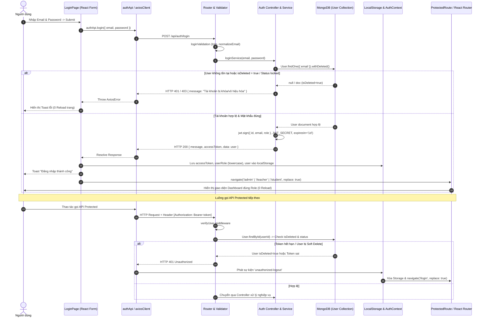

# 🔄 Phân Tích & Sơ Đồ Luồng Xác Thực (Auth Flow Review)

**Dự án:** Hệ thống Quản lý Học tập AI (AI LMS)  
**Tác giả audit:** Principal Security Engineer & Senior Fullstack Architect  
**Ngày đánh giá:** 28/07/2026  

---

## 📑 Mục Lục
1. [Tổng Quan Luồng Xác Thực (Auth Flow Overview)](#1-tổng-quan-luồng-xác-thực-auth-flow-overview)
2. [Sơ Đồ Luồng Xác Thực End-to-End (Mermaid Sequence Diagram)](#2-sơ-đồ-luồng-xác-thực-end-to-end-mermaid-sequence-diagram)
3. [Phân Tích Từng Bước Luồng Xử Lý (Detailed Step-by-Step Breakdown)](#3-phân-tích-từng-bước-luồng-xử-lý-detailed-step-by-step-breakdown)
4. [Các Điểm Đã Được Tối Ưu & Sửa Lỗi Trong Luồng](#4-các-điểm-đã-được-tối-ưu--sửa-lỗi-trong-luồng)

---

## 1. Tổng Quan Luồng Xác Thực (Auth Flow Overview)

Luồng xác thực của hệ thống AI LMS được thiết kế theo mô hình **Single Page Application (SPA)** với Frontend React và Backend Express REST API truyền tải JWT Access Token thông qua `Authorization: Bearer <token>` Header.

---

## 2. Sơ Đồ Luồng Xác Thực End-to-End (Mermaid Sequence Diagram)

---

## 3. Phân Tích Từng Bước Luồng Xử Lý (Detailed Step-by-Step Breakdown)

1. **Gửi thông tin:** Người dùng điền Email/Password tại `LoginPage.tsx`. Ant Design / React Hook Form kiểm tra định dạng email và minLength 6 ký tự tại Client.
2. **Gọi API:** `authApi.login()` chuyển payload qua `axiosClient` tới `POST /api/auth/login`.
3. **Backend Validate:** Express Validator chạy `loginValidation`: normalize email về chữ thường, kiểm tra password không rỗng.
4. **Kiểm tra DB & Soft Delete:** `loginService` trong `auth.services.js` gọi `User.findOne({ email }).withDeleted()`. Nếu `isDeleted === true` ➔ Ném lỗi HTTP 403 "Tài khoản đã bị vô hiệu hóa".
5. **Băm mật khẩu:** `bcrypt.compare(password, user.password)` đối chiếu chuỗi thô và hash.
6. **Cấp Token:** `jwt.sign()` ký token hạn 1d với `id`, `email`, `role`.
7. **Phản hồi Client:** Trả về HTTP 200 `{ message, accessToken, data: user }`.
8. **Lưu trữ & Chuyển hướng:** `LoginPage.tsx` trích xuất `accessToken`, `data` (User) và `userRole` (được `.toLowerCase()`), lưu `localStorage` và gọi `navigate('/<role>')`.
9. **Gọi API Protected:** `axiosClient` đính kèm `Authorization: Bearer <token>`. Middleware `verifyUser` ở Backend giải mã token VÀ kiểm tra lại trạng thái DB thực tế của User.

---

## 4. Các Điểm Đã Được Tối Ưu & Sửa Lỗi Trong Luồng

- ✅ **Khắc phục bóc tách Response sai:** Sửa `LoginPage.tsx` bóc tách trực tiếp `res.data.accessToken` thay vì đọc nhầm `res.data.data.accessToken`.
- ✅ **Chống rò rỉ session do Soft Delete:** `verifyUser` middleware giờ đây query DB kiểm tra `isDeleted` và `status` ở từng request.
- ✅ **Loại bỏ hoàn toàn reload trang:** Toàn bộ luồng Login & Logout chạy mượt mà qua React Router `navigate()`.
