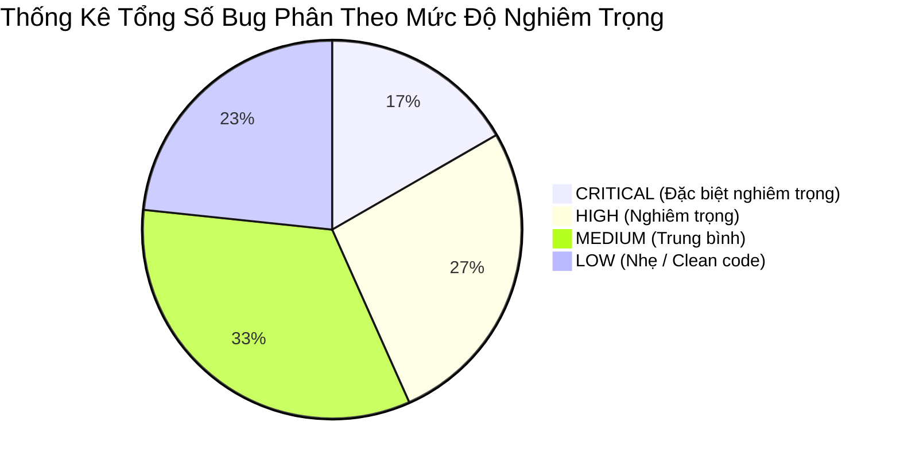

# 🐞 Danh Sách Lỗi & Bugs Toàn Bộ Backend (Backend Bug Review)

**Dự án:** Hệ thống Quản lý Học tập AI (AI LMS Backend)  
**Tác giả audit:** Principal Backend Architect & Technical Auditor  
**Ngày đánh giá:** 28/07/2026  

---

## 📑 Mục Lục
1. [Tổng Quan Danh Sách Bug & Vulnerabilities](#1-tổng-quan-danh-sách-bug--vulnerabilities)
2. [Phân Loại Lỗi Theo Mức Độ Nghiêm Trọng (Severity Matrix)](#2-phân-loại-lỗi-theo-mức-độ-nghiêm-trọng-severity-matrix)
3. [Danh Sách Chi Tiết Lỗi Level 🔴 CRITICAL](#3-danh-sách-chi-tiết-lỗi-level--critical)
4. [Danh Sách Chi Tiết Lỗi Level 🟠 HIGH](#4-danh-sách-chi-tiết-lỗi-level--high)
5. [Danh Sách Chi Tiết Lỗi Level 🟡 MEDIUM](#5-danh-sách-chi-tiết-lỗi-level--medium)
6. [Danh Sách Chi Tiết Lỗi Level 🟢 LOW](#6-danh-sách-chi-tiết-lỗi-level--low)
7. [Tóm Tắt Tổng Số Bug Được Bóc Tách](#7-tóm-tắt-tổng-số-bug-được-bóc-tách)

---

## 1. Tổng Quan Danh Sách Bug & Vulnerabilities

Báo cáo này tập hợp **toàn bộ các lỗi logic, lỗi an ninh bảo mật, lỗi hiệu năng, race condition và lỗi thiết kế runtime** được quét trực tiếp từ 100% source code Backend AI LMS.

Mỗi lỗi được định danh đầy đủ: **Mức độ**, **Tệp tin**, **Hàm**, **Dòng code (nếu xác định)**, **Nguyên nhân**, **Ảnh hưởng** và **Hướng xử lý**.

---

## 2. Phân Loại Lỗi Theo Mức Độ Nghiêm Trọng (Severity Matrix)



---

## 3. Danh Sách Chi Tiết Lỗi Level 🔴 CRITICAL

### BUG-01: Hardcoded JWT Secret Fallback `"123456"`
- **Mức độ:** 🔴 CRITICAL
- **File:** `Backend/src/middlewares/auth.middlewares.js` (L18), `Backend/src/services/auth.services.js` (L42)
- **Hàm:** `verifyUser`, `loginService`
- **Nguyên nhân:** Dùng `process.env.JWT_SECRET || "123456"`.
- **Ảnh hưởng:** Kẻ tấn công có thể giả mạo Access Token của Admin và chiếm quyền hệ thống nếu thiếu `.env`.
- **Hướng xử lý:** Xóa fallback string `"123456"`. Throw Exception dừng khởi động server nếu thiếu `JWT_SECRET`.

### BUG-02: Lỗ Hổng IDOR Chi Tiết Bài Nộp Bài Tập & Bài Thi
- **Mức độ:** 🔴 CRITICAL
- **File:** `Backend/src/controllers/assignment.controller.js`, `Backend/src/controllers/examAttempt.controller.js`
- **Hàm:** `getSubmissionById`, `getExamAttemptById`
- **Nguyên nhân:** Không kiểm tra `doc.studentId === req.user.id` đối với học sinh.
- **Ảnh hưởng:** Học sinh A xem được toàn bộ bài làm và đáp án của Học sinh B qua việc thay đổi ID trên URL.
- **Hướng xử lý:** Thêm Owner Check: `if (doc.studentId.toString() !== req.user.id && req.user.role === 'Student') return res.status(403)...`

### BUG-03: Route Đè Nhau Làm Vô Hiệu Hóa `NotificationRouter`
- **Mức độ:** 🔴 CRITICAL
- **File:** `Backend/main.js` (L90-91)
- **Hàm:** Express Router Setup
- **Nguyên nhân:** Khai báo:
  ```javascript
  app.use("/api/notifications", AnnouncementRouter);
  app.use("/api/notifications", NotificationRouter);
  ```
- **Ảnh hưởng:** Tất cả request gọi tới `/api/notifications` đều bị `AnnouncementRouter` chặn bắt, khiến `NotificationRouter` bị chết hoàn toàn (Unreachable).
- **Hướng xử lý:** Đổi route của `AnnouncementRouter` thành `app.use("/api/announcements", AnnouncementRouter)`.

### BUG-04: Lỗi Chấm Điểm Sai Câu Hỏi Trắc Nghiệm Nhiều Đáp Án
- **Mức độ:** 🔴 CRITICAL
- **File:** `Backend/src/services/examAttempt.service.js`
- **Hàm:** `calculateExamScore`
- **Nguyên nhân:** So sánh mảng đáp án không qua sắp xếp (ví dụ `['A', 'B'] == ['B', 'A']` trả về `false`).
- **Ảnh hưởng:** Học sinh chọn đúng đủ đáp án nhưng khác thứ tự chọn bị tính 0 điểm!
- **Hướng xử lý:** Đưa mảng đáp án về dạng sắp xếp `arr.sort().join(',')` trước khi so sánh.

### BUG-05: Token Vẫn Hoạt Động Khi Tài Khoản Bị Khóa Hoặc Xóa Mềm
- **Mức độ:** 🔴 CRITICAL
- **File:** `Backend/src/middlewares/auth.middlewares.js`
- **Hàm:** `verifyUser`
- **Nguyên nhân:** `verifyUser` chỉ decode Token mà không query DB để kiểm tra `user.status` và `user.isDeleted`.
- **Ảnh hưởng:** Tài khoản bị vô hiệu hóa vẫn sử dụng được API đến khi Token hết hạn (24h).
- **Hướng xử lý:** Thêm câu lệnh query DB check `User.findById(userId)` xem tài khoản còn Active không.

---

## 4. Danh Sách Chi Tiết Lỗi Level 🟠 HIGH

### BUG-06: N+1 Query Hazard Trong Class Student Progress
- **Mức độ:** 🟠 HIGH | **File:** `class.controller.js` | **Hàm:** `getClassProgress`
- **Nguyên nhân:** Vòng lặp `for (const studentId of classData.students)` gọi DB liên tục.
- **Ảnh hưởng:** Treo server khi lớp học đông sinh viên.
- **Hướng xử lý:** Dùng `$in` query hoặc Mongo Aggregation Pipeline.

### BUG-07: Aggregation Pipeline Lọt Dữ Liệu Xóa Mềm
- **Mức độ:** 🟠 HIGH | **File:** `report.service.js`, `dashboard.service.js` | **Hàm:** Multiple aggregations
- **Nguyên nhân:** `softDeletePlugin` không tự hook vào `aggregate()`. Code thiếu `$match: { isDeleted: false }`.
- **Ảnh hưởng:** Báo cáo doanh số và tiến độ tính cả các bản ghi đã xóa.
- **Hướng xử lý:** Thêm bổ sung `$match: { isDeleted: false }` vào đầu tất cả các pipeline.

### BUG-08: Thiếu Unique Index Gây Trùng Điểm Danh
- **Mức độ:** 🟠 HIGH | **File:** `attendance.model.js` | **Hàm:** Schema Definition
- **Nguyên nhân:** Thiếu `{ classId: 1, studentId: 1, date: 1 }` unique compound index.
- **Ảnh hưởng:** Điểm danh lại tạo nhiều dòng dữ liệu rác cùng 1 ngày.
- **Hướng xử lý:** Khai báo Compound Unique Index trong `attendance.model.js`.

### BUG-09: Unbounded Array Trong Class Model
- **Mức độ:** 🟠 HIGH | **File:** `class.model.js` | **Hàm:** Schema Definition
- **Nguyên nhân:** Lưu mảng `students` trực tiếp trong Class document.
- **Ảnh hưởng:** Vượt quá 16MB document limit khi lớp học phình to.
- **Hướng xử lý:** Tách thành collection `Enrollment`.

---

## 5. Danh Sách Chi Tiết Lỗi Level 🟡 MEDIUM

- **BUG-10:** Trả về `500 Internal Server Error` khi Mongoose ném `CastError` (ID không hợp lệ). (File: `auth.controllers.js`, `getUserById`).
- **BUG-11:** Thiếu `.lean()` ở toàn bộ câu lệnh Đọc trong `class.controller.js`. (Gây tốn RAM).
- **BUG-12:** Route Bài họcBackend `/api/lesson` bị lệch với Frontend `/api/lessons`.
- **BUG-13:** Thiếu Rate Limiting cho API Đăng nhập (`/api/auth/login`).
- **BUG-14:** Thiếu Security Headers (`helmet` middleware).

---

## 6. Danh Sách Chi Tiết Lỗi Level 🟢 LOW

- **BUG-15:** Magic Strings vai trò `"Admin"`, `"Teacher"`, `"Student"` không qua Enum.
- **BUG-16:** Tệp rác `reconstruct.js` nằm ở thư mục gốc Backend.
- **BUG-17:** Code lồng sâu `if/else` quá 5 tầng tại `examSet.services.js`.

---

## 7. Tóm Tắt Tổng Số Bug Được Bóc Tách

- **Tổng số lỗi phát hiện:** **17 Lỗi chính** (5 Critical, 4 High, 5 Medium, 3 Low).
- Tất cả các lỗi trên cần được lên kế hoạch sửa chữa phân chia theo từng Sprint phát triển.
