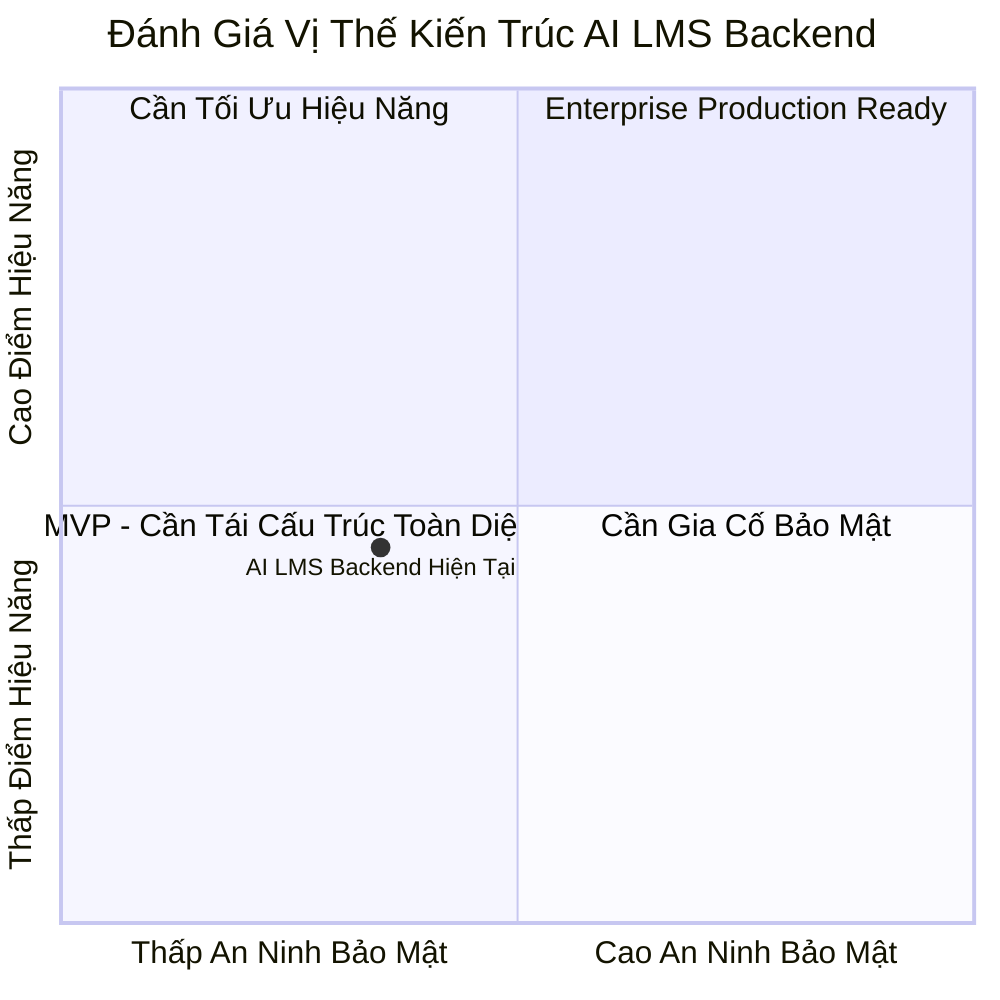

# 📊 Bảng Điểm Đánh Giá Kiến Trúc Tổng Thể (Backend Scorecard)

**Dự án:** Hệ thống Quản lý Học tập AI (AI LMS Backend)  
**Tác giả audit:** Principal Backend Architect & Technical Auditor  
**Ngày đánh giá:** 28/07/2026  

---

## 📑 Mục Lục
1. [Phương Pháp Đánh Giá (Audit Scoring Methodology)](#1-phương-pháp-đánh-giá-audit-scoring-methodology)
2. [Bảng Điểm Chi Tiết Theo 11 Tiêu Chí Enterprise](#2-bảng-điểm-chi-tiết-theo-11-tiêu-chí-enterprise)
3. [Phân Tích Chi Tiết Đánh Giá Chi Tiết Theo Tiêu Chí](#3-phân-tích-chi-tiết-đánh-giá-chi-tiết-theo-tiêu-chí)
4. [Biểu Đồ Radar Đánh Giá Năng Lực Kiến Trúc](#4-biểu-đồ-radar-đánh-giá-năng-lực-kiến-trúc)
5. [Kết Luận Tổng Thể & Trạng Thái Production-Ready](#5-kết-luận-tổng-thể--trạng-thái-production-ready)

---

## 1. Phương Pháp Đánh Giá (Audit Scoring Methodology)

Thang điểm từ **0 đến 10** được đánh giá dựa trên tiêu chuẩn Enterprise Software Engineering:
- **9.0 - 10.0:** Excellent (Đạt chuẩn Enterprise, sẵn sàng Scale lớn).
- **7.0 - 8.9:** Good (Hoạt động tốt, cần tối ưu nhẹ).
- **5.0 - 6.9:** Average (Cần cải thiện nhiều điểm trước khi ra Production).
- **0.0 - 4.9:** Poor (Không đạt chuẩn, chứa nhiều lỗ hổng nghiêm trọng).

---

## 2. Bảng Điểm Chi Tiết Theo 11 Tiêu Chí Enterprise

| STT | Tiêu Chí Đánh Giá (Evaluation Criteria) | Thang Điểm (0-10) | Trạng Thái | Ghi Chú Tóm Tắt |
| :---: | :--- | :---: | :---: | :--- |
| 1 | **Architecture & Modularization** | **5.5 / 10** | ⚠ Cần cải thiện | Layering bị phá vỡ; Controller query DB trực tiếp; God Service 77KB. |
| 2 | **Scalability & System Limits** | **4.5 / 10** | ❌ Sai thiết kế | Vòng lặp N+1 Query; Unbounded Array `students` trong Class model. |
| 3 | **Maintainability & Clean Code** | **5.0 / 10** | ⚠ Cần cải thiện | Magic strings/numbers; Code lồng sâu >5 tầng; File monolith. |
| 4 | **Security (OWASP Compliance)** | **3.5 / 10** | 🔴 Nguy hiểm | Fallback Hardcoded Secret Key `"123456"`; IDOR bài làm; Thiếu Rate Limit. |
| 5 | **Performance & Optimization** | **4.5 / 10** | ❌ Sai thiết kế | Thiếu `.lean()`; Quên Compound Indexes; Sequential Awaiting. |
| 6 | **Testing & Quality Assurance** | **1.0 / 10** | 🔴 Nguy hiểm | Hoàn toàn **thiếu Unit Tests & Integration Tests** (0% Test Coverage). |
| 7 | **Deployment & Infrastructure** | **6.0 / 10** | ⚠ Cần cải thiện | Có Dockerfile cơ bản nhưng thiếu CI/CD Pipeline hóa tự động. |
| 8 | **Monitoring & Observability** | **2.0 / 10** | 🔴 Nguy hiểm | Thiếu Health Check endpoint chuẩn; Thiếu Prometheus/Metrics exporter. |
| 9 | **Logging & Traceability** | **3.0 / 10** | 🔴 Nguy hiểm | Dùng `console.log`; Thiếu Winston/Pino; Thiếu Correlation Request ID. |
| 10 | **Documentation & API Specs** | **6.5 / 10** | ⚠ Cần cải thiện | Đã có tài liệu markdown sơ bộ nhưng thiếu Swagger / OpenAPI 3.0 spec. |
| 11 | **Database & Data Integrity** | **6.0 / 10** | ⚠ Cần cải thiện | Schema tương đối rõ; Soft Delete lọt Aggregation; Thiếu Transactions. |

---

## 3. Phân Tích Chi Tiết Đánh Giá Chi Tiết Theo Tiêu Chí

- **ĐIỂM TRUNG BÌNH TỔNG THỂ (OVERALL SCORE):** **4.32 / 10**

### 🎯 Đánh Giá Tổng Quan:
Hệ thống AI LMS hiện tại mang đặc trưng của một dự án **MVP (Minimum Viable Product)** được phát triển nhanh. Hệ thống đã có khung tính năng phong phú nhưng **CHƯA ĐẠT CHUẨN ENTERPRISE PRODUCTION-READY** do tích tụ nhiều Nợ Kỹ Thuật (Technical Debt) ở các mảng **Security**, **Performance**, **Testing** và **Logging**.

---

## 4. Biểu Đồ Radar Đánh Giá Năng Lực Kiến Trúc

---

## 5. Kết Luận Tổng Thể & Trạng Thái Production-Ready

- 🔴 **TRẠNG THÁI PRODUCTION-READY:** **NOT READY (CHƯA SẴN SÀNG KHỞI CHẠY PRODUCTION)**
- **Khuyến cáo:** Bắt buộc thực hiện đợt sửa lỗi (Sprint 1 & Sprint 2) theo roadmap tại `fix-roadmap.md` trước khi cho phép người dùng thực tế đăng nhập hệ thống.
