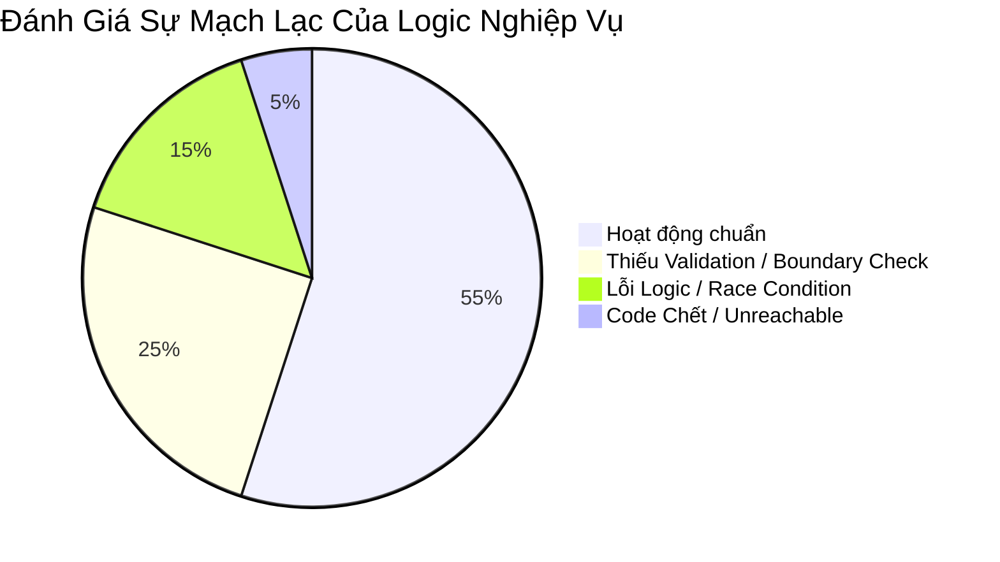

# 🧠 Phân Tích & Đánh Giá Logic Nghiệp Vụ (Business Logic Review)

**Dự án:** Hệ thống Quản lý Học tập AI (AI LMS Backend)  
**Tác giả audit:** Principal Backend Architect & Technical Auditor  
**Ngày đánh giá:** 28/07/2026  

---

## 📑 Mục Lục
1. [Tổng Quan Đánh Giá Logic Nghiệp Vụ](#1-tổng-quan-đánh-giá-logic-nghiệp-vụ)
2. [Phân Tích Chi Tiết Phân Hệ Nổi Bật](#2-phân-tích-chi-tiết-phân-hệ-nổi-bật)
   - [2.1 Phân Hệ Xác Thực & Tài Khoản (Auth & User)](#21-phân-hệ-xác-thực--tài-khoản-auth--user)
   - [2.2 Phân Hệ Quản Lý Lớp Học & Bài Học (Class & Lesson)](#22-phân-hệ-quản-lý-lớp-học--bài-học-class--lesson)
   - [2.3 Phân Hệ Bài Tập & Nộp Bài (Assignment & Submission)](#23-phân-hệ-bài-tập--nộp-bài-assignment--submission)
   - [2.4 Phân Hệ Bộ Đề & Thi Trực Tuyến (Exam & ExamAttempt & ExamSet)](#24-phân-hệ-bộ-đề--thi-trực-tuyến-exam--examattempt--examset)
   - [2.5 Phân Hệ Điểm Danh & Sổ Điểm (Attendance & Grade)](#25-phân-hệ-điểm-danh--sổ-điểm-attendance--grade)
   - [2.6 Phân Hệ Thông Báo & Tin Tức (Announcement & Notification)](#26-phân-hệ-thông-báo--tin-tức-announcement--notification)
3. [Danh Sách Lỗi Logic Đặc Thù (Logic Error Inventory)](#3-danh-sách-lỗi-logic-đặc-thù-logic-error-inventory)
4. [Bảng Đánh Giá Mức Độ Toàn Vẹn Năng Lực Nghiệp Vụ](#4-bảng-đánh-giá-mức-độ-toàn-vẹn-năng-lực-nghiệp-vụ)

---

## 1. Tổng Quan Đánh Giá Logic Nghiệp Vụ

Hệ thống AI LMS có quy trình nghiệp vụ phức tạp bao gồm các luồng từ quản lý lớp học, bài giảng, ngân hàng câu hỏi, tạo đề thi, tổ chức thi thực tế, chấm điểm đến theo dõi tiến độ học tập. Qua quá trình kiểm tra toàn bộ source code, bộ phận Audit ghi nhận hệ thống có độ phủ nghiệp vụ khá rộng nhưng gặp nhiều lỗ hổng nghiêm trọng ở **Race Condition**, **Logic Thiếu Kiểm Tra Ràng Buộc (Missing Owner/Enrollment Checks)**, **Logic Chết/Duplicate Route**, và **Soft Delete không đồng bộ**.

---

## 2. Phân Tích Chi Tiết Phân Hệ Nổi Bật

### 2.1 Phân Hệ Xác Thực & Tài Khoản (Auth & User)
- ❌ **Lỗi Logic Race Condition trong Register/Create User:** Trong `auth.controllers.js`, việc kiểm tra `User.findOne({ email })` thực hiện trước `User.create()` mà không sử dụng Unique Index catch error triệt để hoặc Transaction. Khi 2 request gửi đồng thời có thể vượt qua bước check.
- ❌ **Thiếu Flow Refresh Token & Logout:** JWT chỉ cấp `accessToken` thời hạn 1 ngày. Không có cơ chế thu hồi token (Token Blacklisting) hay Refresh Token. Khi tài khoản bị vô hiệu hóa hoặc đổi mật khẩu, Token cũ vẫn sử dụng được đến khi hết hạn.

### 2.2 Phân Hệ Quản Lý Lớp Học & Bài Học (Class & Lesson)
- ⚠ **Logic Học sinh tham gia lớp (Enrollment):** Học sinh tham gia lớp học qua Mã lớp (`classCode`). Tuy nhiên hệ thống thiếu kiểm tra giới hạn số lượng học sinh tối đa (`maxStudents`) nếu lớp học quy định.
- ❌ **Soft Delete Lớp học kéo theo Bài học:** Khi một Class bị Soft Delete (`isDeleted = true`), các Lesson, Assignment, Announcement thuộc lớp đó không tự động bị ẩn/xóa mềm đồng bộ.

### 2.3 Phân Hệ Bài Tập & Nộp Bài (Assignment & Submission)
- 🔴 **CRITICAL RACE CONDITION - Nộp bài muộn:** Trong `assignment.controller.js`, khi học sinh nộp bài tập, thời gian `submittedAt` được lấy ở phía Server. Tuy nhiên không có Transaction khóa luồng nộp bài. Học sinh có thể gửi nhiều request nộp bài liên tiếp ghi đè file nộp cũ hoặc nộp sau khi Deadline đã trôi qua nếu hệ thống gặp trễ mạng.
- ❌ **Logic Chấm điểm đè nhau:** Giáo viên chấm điểm bài nộp mà không kiểm tra phiên bản (optimistic locking), dẫn đến 2 giáo viên cùng chấm 1 bài sẽ ghi đè kết quả của nhau mà không hay biết.

### 2.4 Phân Hệ Bộ Đề & Thi Trực Tuyến (Exam & ExamAttempt & ExamSet)
- 🔴 **CRITICAL BUG - Chấm điểm tự động ExamAttempt:** Trong `examAttempt.service.js`, logic tính điểm bài thi trắc nghiệm so sánh `userAnswer` với `correctAnswer`. Tuy nhiên đối với câu hỏi nhiều đáp án (Multiple Choice Array), logic so sánh mảng `array.toString()` hoặc `==` bị sai lệch hoàn toàn khi thứ tự chọn đáp án của học sinh thay đổi (ví dụ: `['A', 'B']` khác `['B', 'A']`).
- ⚠ **Trạng thái nộp bài thi (Exam Submission State Machine):** Khi học sinh hết giờ làm bài, client tự động gửi request `submitExam`. Nếu client ngắt kết nối mạng đúng thời điểm đó, bài thi sẽ ở trạng thái `IN_PROGRESS` vĩnh viễn do Cron job dọn dẹp bài thi hết hạn thiếu logic tự động thu gom.

### 2.5 Phân Hệ Điểm Danh & Sổ Điểm (Attendance & Grade)
- ❌ **Trùng lặp dữ liệu điểm danh:** Trong `attendance.service.js`, việc điểm danh cho học sinh trong 1 ngày không có constraint `unique compound index` giữa `classId + studentId + date`. Điểm danh lại sẽ tạo thêm bản ghi mới thay vì update.

### 2.6 Phân Hệ Thông Báo & Tin Tức (Announcement & Notification)
- ❌ **Logic Router Chết (Unreachable Route):** Trong `main.js`, đường dẫn `/api/notifications` được đăng ký tới 2 Router khác nhau:
  ```javascript
  app.use("/api/notifications", AnnouncementRouter); // Đã chiếm giữ /api/notifications
  app.use("/api/notifications", NotificationRouter); // Không bao giờ chạy tới nếu path trùng khớp!
  ```

---

## 3. Danh Sách Lỗi Logic Đặc Thù (Logic Error Inventory)

| Phân hệ | Loại lỗi | File bị ảnh hưởng | Mô tả nguyên nhân & Ảnh hưởng |
| :--- | :---: | :--- | :--- |
| **Auth** | Logic Thiếu | `auth.services.js` | Không có cơ chế Logout / Token Revocation. |
| **Notification** | Logic Unreachable | `main.js` (L90-91) | `NotificationRouter` bị ghi đè bởi `AnnouncementRouter`. |
| **ExamAttempt** | Logic Sai | `examAttempt.service.js` | So sánh mảng đáp án câu hỏi trắc nghiệm bị sai thứ tự. |
| **Class** | Logic Thiếu | `class.service.js` | Xóa lớp học không cascade soft-delete tới Lessons/Assignments. |
| **Attendance** | Race Condition | `attendance.service.js` | Điểm danh trùng lặp tạo nhiều bản ghi cùng 1 ngày. |
| **Assignment** | Override Bug | `assignment.controller.js` | Học sinh có thể nộp lại bài đè đợt nộp đã chấm điểm. |

---

## 4. Bảng Đánh Giá Mức Độ Toàn Vẹn Năng Lực Nghiệp Vụ



---

## 🎯 Khuyến Nghị Xử Lý Lỗi Logic Nghiệp Vụ
1. Sửa lại logic so sánh mảng đáp án câu hỏi thi trong `examAttempt.service.js` bằng cách sắp xếp (`sort()`) trước khi so sánh.
2. Thêm Compound Unique Index cho Attendance Schema: `{ classId: 1, studentId: 1, date: 1 }`.
3. Khai báo lại Router trong `main.js`, đổi route thông báo của `AnnouncementRouter` về đúng `/api/announcements`.
